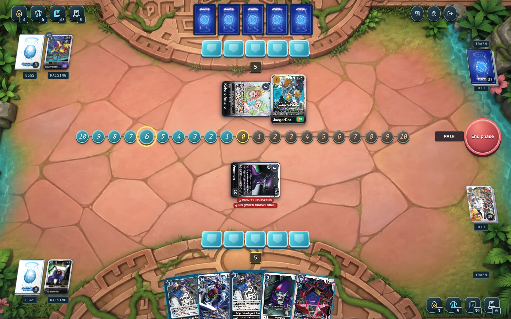
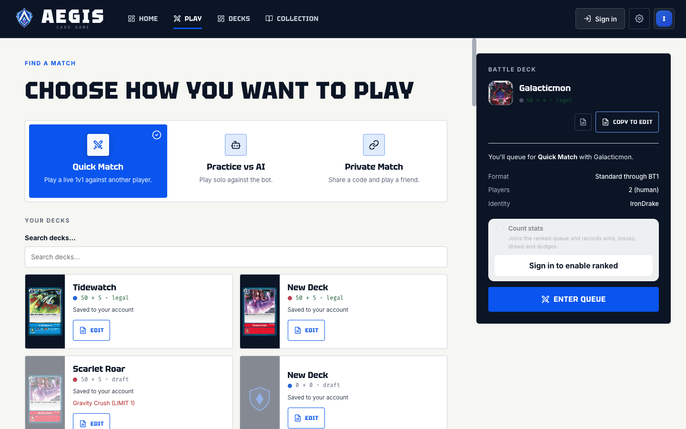
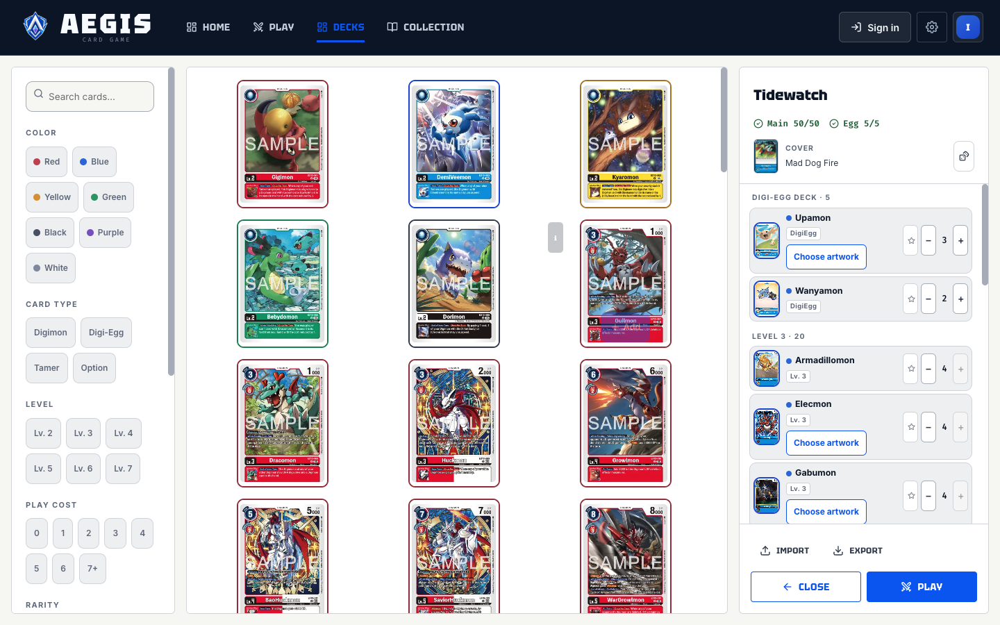
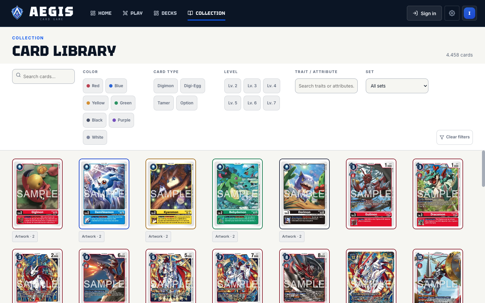
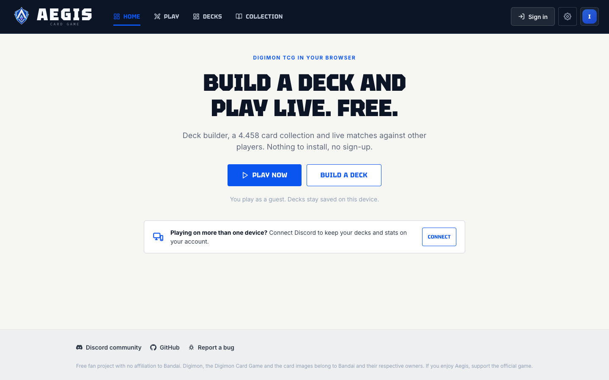
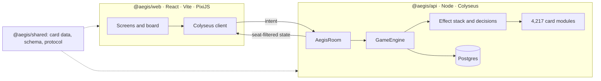

<div align="center">

# Aegis

**Play the Digimon Card Game in a browser tab. No download, no desktop client.**

[Play now](https://aegis-digi.online) &nbsp;·&nbsp; [Discord](https://discord.gg/4EDa5Hhd6f) &nbsp;·&nbsp; [Architecture](./docs/ARCHITECTURE.md) &nbsp;·&nbsp; [API contract](./docs/API-CONTRACT.md)



</div>

> Aegis is an unofficial, non-commercial fan project. Bandai does not sponsor,
> endorse or affiliate with it.

---

## What it does

- **1v1 matches** against a live opponent, a friend by invite code, or the bot.
- **Full card pool**: 4,388 cards across 65 sets, searchable by color, type, level, trait and cost.
- **Deck builder** with legality checks, level curve, color balance, import and export.
- **Tournaments** with fixed rules, a frozen ban list and a server-owned clock.
- **Server-authoritative rules**: the API decides every legal play, so a patched client changes nothing.

## Screens

| Lobby | Deck builder |
| :---: | :---: |
|  |  |
| **Card library** | **Home** |
|  |  |

## Architecture



A turn moves through six steps:

1. A client joins an `AegisRoom` and receives a state view for its seat alone.
2. The client sends an intent: play this card, digivolve here, attack that Digimon.
3. `GameEngine` validates the actor, phase, cost, targets and pending interactions.
4. Engine actions move cards through the state-access seam and push effects onto the stack.
5. A decision pauses resolution until the owning player answers.
6. Colyseus syncs the result, hiding what the seat must not see.

The client sends choices. It never sends state, and it never rules on legality.

### Packages

| Package | Owns |
| --- | --- |
| `@aegis/api` | Colyseus rooms, rules engine, card behavior, bots, tournaments, persistence |
| `@aegis/web` | React and PixiJS client, deck builder, lobby, board rendering |
| `@aegis/shared` | Card catalog, synchronized schema, protocol types, ban list |

Dependencies point inward. Both apps depend on `@aegis/shared`; neither app
depends on the other; game rules never cross into the client.

### By the numbers

| | |
| --- | --- |
| Cards in the catalog | 4,388 across 65 sets |
| Card behavior modules | 4,217 under `apps/api/src/cards/` |
| Test files | 3,694 |
| Rules knowledge base | official rules, rulings, errata and ban list in `data/kb/` |

## Why not DCGO?

DCGO works, and it is a good client. It also asks you to install a desktop
build.

I wanted the option to play in a browser, so I built one.

## Quick start

Requires Node.js 20+ and pnpm 10 through Corepack.

```bash
corepack enable
pnpm install
pnpm dev
```

`pnpm dev` starts the shared package in watch mode, the API on port `2567`, and
the client at `http://localhost:5173`. The client talks to `ws://localhost:2567`
unless you set `VITE_AEGIS_API_URL`.

### Commands

```bash
pnpm dev           # run the whole development workspace
pnpm build         # build shared, API and web
pnpm typecheck     # type-check every package
pnpm test          # run package test suites
pnpm test:tools    # run repository tool tests
pnpm lint          # Oxlint
pnpm format:check  # Oxfmt
pnpm ci            # the full verification suite
```

Target one package with a filter:

```bash
pnpm --filter @aegis/api dev
pnpm --filter @aegis/web dev
pnpm --filter @aegis/shared dev
```

## Repository layout

```text
.
├── apps/
│   ├── api/          # authoritative server, engine, cards, bots, tournaments
│   └── web/          # browser client
├── packages/shared/  # schema, protocol, types, card catalog
├── data/kb/          # rules, rulings, errata, ban list
├── docs/             # architecture, protocol, releases, operations
├── tools/            # validation, import, release, deployment scripts
└── docker-compose.yml
```

## Implementing a card

Each card is one TypeScript module:

```text
apps/api/src/cards/<SET>/<CARD-ID>.ts
```

A module carries either a hand-written `EffectModule` built from effect
primitives, or a declarative `CompiledCard` the shared runtime interprets.
Importing `apps/api/src/cards/index.ts` registers every module at boot. No
generator sits between the card text and the code.

Tests live beside the module and assert observable game state, not internals.
`data/kb/` supplies the official rulings and errata that decide the hard cases.

## Hosting and donations

I run Aegis on my own server in Brazil, next to my other apps. The server is
already paid for and already running, so Aegis costs me nothing to host.

Aegis takes no donations. There is no sponsor button, no Patreon, no crypto
address, and no plan to add one. If someone asks you to pay for Aegis, they do
not speak for this project.

Spend the money on the official Digimon Card Game instead. If you want to help
here, open an issue, fix a card, or bring a friend to a match.

## Contributing

Pull requests are welcome. Before you open one:

1. Keep rules and state transitions in the API.
2. Add or update tests for observable behavior.
3. Run `pnpm ci`.
4. Keep commits focused, and say what changed for players or for the rules.

## Legal

The source code ships under the MIT License. Digimon, the Digimon Card Game,
card artwork, card text and related trademarks belong to their owners and fall
outside that license.

This project is a non-commercial community effort. The MIT License places no
such limit on your use of the software. If you enjoy Aegis, support the
official Digimon Card Game.

## Credits

Card data comes from the community-maintained
[TakaOtaku/Digimon-Card-App](https://github.com/TakaOtaku/Digimon-Card-App)
database (`src/assets/cardlists/DigimonCards.json`, MIT License, © Christian
Bayer). `tools/import-taka-cards.mjs` maps those records into this project's
`CardDefinition` shape. Thanks to its maintainers and contributors.

Player portraits come from the PlayStation *Digimon World* card sheets ripped by
**metaldodomon** and published on The Spriters Resource. `tools/extract-dw-card-avatars.py`
slices those sheets into the files under `apps/web/public/avatars/digimon-world-1/`.

## License

[MIT](./LICENSE) © Vinícius Luiz.
