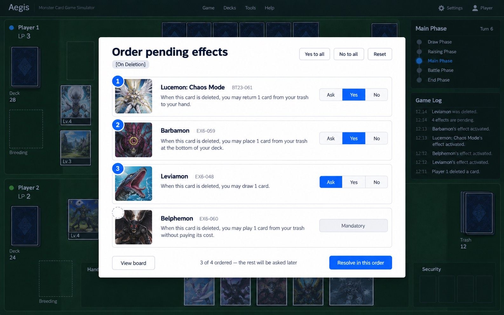
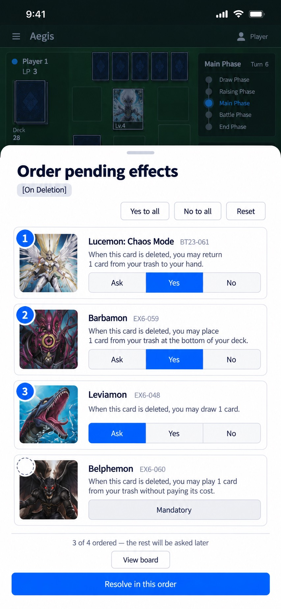
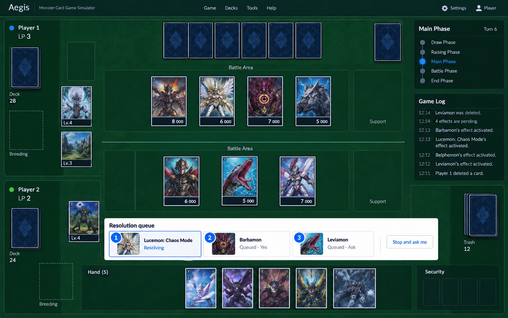
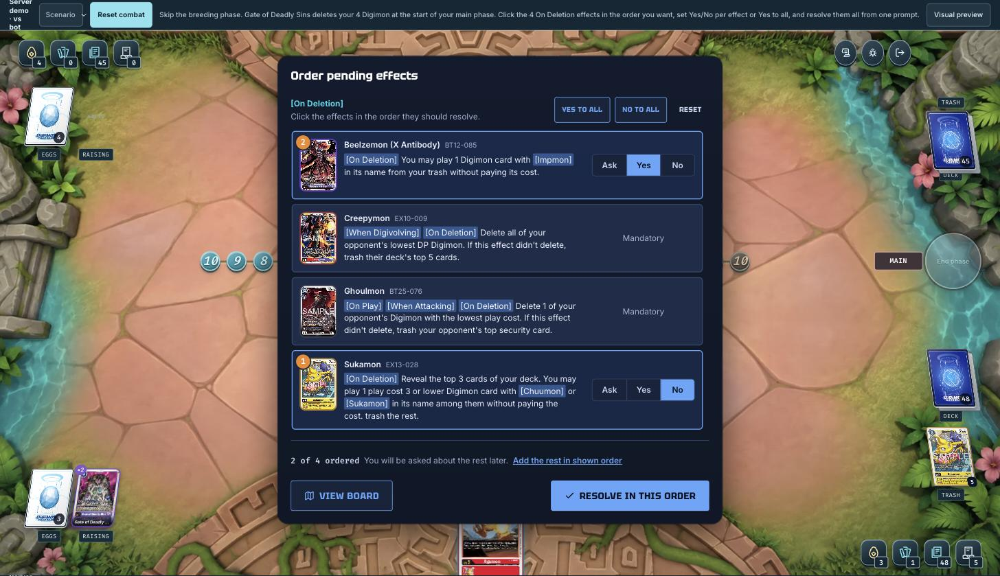

# Effect resolution plan

Players can order all their simultaneous effects in one prompt and preset the yes/no
questions those effects ask. This removes the chain of repeated prompts that cards such as
Gate of Deadly Sins (EX6-006), Mother Eater (BT22-007) and King Drasil_7D6 (BT23-072) cause.

Source request (Discord, SagaSol): click effects to set their resolution order, the way
Assembly materials are picked, and add "Yes to all" and "No to all".

## Problem

The engine asks about simultaneous effects one at a time:

1. "Which effect resolves next?" (`orderTriggers`, exactly one key).
2. "Use this effect?" (`optional`) for each "you may" part.
3. After each effect resolves, the engine collects again and repeats step 1 for the rest.

With four [On Deletion] effects, a player answers up to 3 order prompts plus one yes/no per
optional effect. A mass play with King Drasil_7D6 on the field can mean one prompt pair per
played Digimon.

## Solution

The player sends a **resolution plan** in reply to the first order prompt:

- `order`: the order for any number of the offered effects, not only the next one.
- `optionalAnswers`: a preset per effect. `true` means Yes and `false` means No. An effect
  with no preset is still asked (Ask).

The server keeps the plan for the rest of that timing window and answers its own repeat
prompts from it.

### Rules the engine follows

| Situation                                                                 | Result                                                                                                                   |
| ------------------------------------------------------------------------- | ------------------------------------------------------------------------------------------------------------------------ |
| Every offered effect is in the plan                                       | The earliest planned effect resolves with no prompt.                                                                     |
| An offered effect is not in the plan (left unordered, or newly triggered) | The prompt opens again. Its answer is added to the front of the plan.                                                    |
| A planned effect can no longer activate (its card left, as in §15-4-4-3)  | The effect drops out. The plan continues with the next one.                                                              |
| Preset Yes                                                                | Every `optional` question from that effect's own controller is answered yes. Card and target choices are still asked.    |
| Preset No                                                                 | Every optional part is declined: `optional` → no, zero-minimum selections → none, an optional modal → its decline entry. |
| The timing window ends                                                    | The plan is discarded, so it never answers for a later window.                                                           |
| The opponent's effects                                                    | Never affected. Presets apply only to the controller's own questions.                                                    |

### Why this design

- **Server-authoritative.** The client does not auto-reply to prompts. So there are no
  extra round-trips, no flicker, and nothing breaks when the player reconnects or times out.
- **Rules-safe.** The engine still collects again after every effect, applies §15-4-5
  activation tiers, and asks again for any new trigger. The plan only answers questions
  the player already answered.
- **Backward compatible.** Existing clients, the bot and the test harness send one key, and
  that is still valid. Prompts that only read the first key (would-leave replacements,
  deletion reactions) do not set `acceptsResolutionPlan`, so the server rejects a plan for
  them.

## Protocol changes

`DecisionRequest.options` (`orderTriggers` only):

- `acceptsResolutionPlan?: boolean`: the server accepts a plan.
- `triggerIsOptional?: boolean[]`: a display hint that controls whether the row shows
  Ask/Yes/No. The server sets it from the effect's `optional` flag or its "you may" or
  "by …ing" text.

`DecisionResponse` for `orderTriggers`:

```ts
{ kind: "orderTriggers"; order: string[]; optionalAnswers?: Record<string, boolean> }
```

The server checks that the order is not empty, has no repeated keys, and uses only offered
keys. `optionalAnswers` must be an object whose keys are offered keys and whose values are
booleans.

## UI

- Click an effect to add it to the order. Its card shows a numbered badge (the same badge
  as the Assembly picker). Click it again to remove it; the others are renumbered.
- Each optional effect has an **Ask / Yes / No** control. Mandatory effects show
  "Mandatory".
- The toolbar has **Yes to all**, **No to all** and **Reset**.
- The footer shows "N of M ordered", a link to add the remaining effects in the shown order,
  and **Resolve in this order**.
- If one effect is selected, the button still reads "Resolve next effect", so the old
  flow works the same way.

Prototypes (generated with Codex image generation):

| Desktop dialog                                                 | Phone sheet                                                  | Future: queue on the board                                     |
| -------------------------------------------------------------- | ------------------------------------------------------------ | -------------------------------------------------------------- |
|  |  |  |

What was built, in `/dev/arena`:



## Dev scenario

`/dev/arena?scenario=arena-gate-deadly-sins-effect-order`

1. Gate of Deadly Sins is in your breeding area. Your field has Beelzemon (X Antibody),
   Creepymon, Ghoulmon and Sukamon, and an Impmon and a Lucemon: Chaos Mode are in your
   trash.
2. The bot plays the first turn. Its two Digimon count as played that turn, so they cannot
   attack your board first.
3. At the start of your main phase, Gate deletes all your Digimon and places one Demon Lord
   from your trash under itself. Pick Lucemon to keep all four [On Deletion] effects.
4. One prompt appears. Order the effects, set Beelzemon to Yes and Sukamon to No, and
   resolve.
5. Everything resolves with no more order or yes/no prompts: Impmon is played, Sukamon's
   optional play is skipped, and Creepymon and Ghoulmon resolve in the planned order.

## Code map

| Area                               | File                                                                            |
| ---------------------------------- | ------------------------------------------------------------------------------- |
| Plan object                        | `apps/api/src/engine/decisions/resolutionPlan.ts`                               |
| Prompt, skip, and preset           | `apps/api/src/engine/decisions/resolverDecisions.ts`                            |
| Window scope (printed effects)     | `apps/api/src/engine/effects/stack.ts` (`resolveTiming`)                        |
| Window scope (SubTrigger watchers) | `apps/api/src/engine/gameEngine/subTriggers.ts` (`runSubTriggersInChosenOrder`) |
| In-body presets                    | `apps/api/src/engine/decisions/decisionApi.ts` (`presetOptionalAnswer`)         |
| Validation                         | `apps/api/src/engine/decisions/index.ts` (`choosesOfferedTriggers`)             |
| Chooser UI                         | `apps/web/src/game/overlay/choice/DecisionTriggerChooser.tsx`                   |
| Scenario                           | `apps/api/src/engine/devScenario.ts`, `apps/web/src/dev/LiveArenaDemo.tsx`      |

Tests:

- `resolutionPlan.test.ts`: plan rules, resolver integration, and validation.
- `gateDeadlySinsEffectOrderScenario.test.ts`: the live turn loop with one prompt.
- `decisionOverlay.test.tsx`: click order, renumbering, presets, and the plain prompt.

## Known limits and next steps

1. **Rows show "you may" based on text.** A collected effect does not expose its compiled
   actions, so `triggerIsOptional` comes from the effect's text. A wrong hint only hides or
   shows the control; the engine still applies any preset it receives. Fix: carry an
   `asksYesNo` flag from the IR compiler onto `Effect`.
2. **Duplicate activations.** A second activation of the same effect in one prompt
   (`/activation-N` keys) is ordered, but its presets are not applied, so its questions are
   still asked.
3. **Resolution queue on the board** (prototype 3). Show the planned queue while it
   resolves, with a "Stop and ask me" button. This needs a new intent to clear the plan.
4. **Mother Eater's start-of-main effect** is a single effect with two optional actions.
   With no second trigger it never reaches the order prompt, so no plan can be set. (The
   three [On Play] effects of the Mother Eaters it plays do reach it and benefit.)
   Possible fix: a persistent per-match setting, "Always use [card]'s optional effects",
   which should be a separate proposal.
5. **Bot and harness** still send one key. They could send full plans to shorten fuzz runs.
