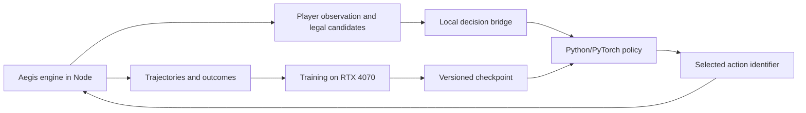

# Local bot training plan for Aegis

Date: 2026-09-26. Inspected baseline: `cae5c3f8b`. Status: implementation plan with remote preflight completed; no Aegis model has been implemented or trained.

The user chose **a strong bot for a few decks first** and authorized testing on the desktop over Tailscale. Train Digimon-specific weights against the Aegis engine, using YGO Agent, Cardsformer, and gym-locm as architectural references. The first release must demonstrate an improvement over the current bot on the selected decks. That result would not establish full-catalog coverage or competitive human-level play.

## Decision and alternatives

| Approach                                                         | Benefit                                                                    | Cost or limitation                                                                               | Decision                                     |
| ---------------------------------------------------------------- | -------------------------------------------------------------------------- | ------------------------------------------------------------------------------------------------ | -------------------------------------------- |
| Compact learned policy, legal-action masks, and varied opponents | Uses the existing engine, supports measurable learning and local inference | Requires a training environment and complete decision coverage                                   | Recommended                                  |
| Search over action sequences with a heuristic evaluator          | Can improve planning without a training dataset                            | Cloning an asynchronous engine with pending choices and hidden information adds substantial work | Later experiment, after measuring the policy |
| Local LLM selecting actions                                      | Quick experiment and textual explanations                                  | Uncertain latency and playing strength; validation and evaluation still required                 | Outside the first release                    |

### What to take from each project

- **YGO Agent:** represent cards, context, and candidate actions; score each candidate against the current state and mask unavailable actions. Its [model](https://github.com/sbl1996/ygo-agent/blob/main/ygoai/rl/jax/agent.py) also uses history and supports recurrent networks. Start without recurrence and add it only if measurements justify it. Its [embedding script](https://github.com/sbl1996/ygo-agent/blob/main/scripts/card/embedding.py) calls Voyage API; Aegis should use structured attributes and optionally generate its own embeddings locally.
- **Cardsformer:** test card text alongside structured attributes, inspired by its [encoder](https://github.com/WannianXia/Cardsformer/blob/main/Algo/encoder.py) and [policy](https://github.com/WannianXia/Cardsformer/blob/main/Model/PolicyModel.py). Initially, text is an optional comparison using frozen, cached vectors. Auxiliary state prediction is deferred. Do not copy implementation or weights without an identified reuse license.
- **gym-locm:** separate environment, training, and evaluation; combine masked actions, fixed opponents, and previous policy versions, as in its [battle trainer](https://github.com/ronaldosvieira/gym-locm/blob/master/gym_locm/toolbox/trainer_battle.py). Its published draft models are not Digimon battle policies.

These projects do not plug directly into one another. YGO Agent declares MIT and Apache-2.0 notices for components; gym-locm declares MIT. Cardsformer is a conceptual reference in this plan. See [the research note](../research-local-tcg-bot.md) for evidence and limitations.

## Deck scope

1. **Infrastructure validation:** use `RED_DECK` and `BLUE_DECK` from [testDecks.ts](../../apps/api/src/engine/testDecks.ts). These are simple test decks, not competitive lists. Compare the new environment with the existing harness.
2. **First useful training run:** proposed lists are `bt4-dgo-2021-06-26-2-wargreymon@2` and `bt4-dgo-2021-06-26-3-imperialdramon@2`, found in the [BT4 catalog](../../packages/shared/src/decks/data/bt4.json). Confirm resolved versions, legality, and complete action coverage before freezing the manifest.
3. **Controlled expansion:** consider `bt4-dgo-2021-06-26-1-security-control@1` and a fourth list after the first comparison. Include cross-deck matchups and mirrors. Evaluate a deck never used for training separately as a generalization experiment.

These are concrete candidate lists, not a coverage certification. The coverage phase may require extending the adapter or replacing a list with a documented reason. Registered card effects do not establish that the bot can select every required action. Never silently omit a necessary mechanic to simplify training.

## Existing components and required changes

| Existing component                                     | Reuse                                     | Required work                                                                                                        |
| ------------------------------------------------------ | ----------------------------------------- | -------------------------------------------------------------------------------------------------------------------- |
| [BotPolicy](../../apps/api/src/bot/policy.ts)          | Separates strategy from the driver        | Support asynchronous inference while preserving synchronous policies                                                 |
| [BotPlayer](../../apps/api/src/bot/BotPlayer.ts)       | Routes decisions and events               | Cancellable waits, deadlines, and stale-response checks in every decision window                                     |
| [BotView](../../apps/api/src/bot/view.ts)              | Initial player-information boundary       | More complete public stacks, zones, statuses, effects, and observable history                                        |
| [candidates.ts](../../apps/api/src/bot/candidates.ts)  | Initial main-phase action representation  | Engine-authoritative legality and coverage; reconstructed candidates currently omit some actions and can be rejected |
| [matchHarness](../../apps/api/src/bot/matchHarness.ts) | Real seeded matches, results, and metrics | Decision-level stepping, separate termination/truncation, and trajectory recording                                   |
| [benchmark](../../apps/api/src/bot/benchmark.test.ts)  | Reproducible current-bot comparison       | Deck matrix, end-to-end timing, uncertainty estimates, and reserved final evaluation                                 |

The candidate generator does not cover every catalog mechanic; the [meta-deck module](../../apps/api/src/bot/metaDecks/index.ts) explicitly notes missing DigiXros support. Filtering current candidates cannot recover actions that were never enumerated. Share engine validators and projections without speculatively executing actions against a live match.

## Proposed architecture



Run simulation, collection, and training inside the same WSL environment, avoiding a Tailscale round trip per move. Use Tailscale/SSH to transfer a pinned revision, launch jobs, and retrieve results. Test production inference on the intended deployment hardware too; the desktop should not become a permanent dependency of online matches.

### Environment and protocol

Build a sequential two-player adapter inspired by [PettingZoo AEC](https://pettingzoo.farama.org/api/aec/), exposing `reset(seed, deckManifest)`, `observe(seat)`, `step(decisionId, actionId)`, and `close()`. A step advances to the next decision for either player or the end of the match. One action is not one turn: the same player may act repeatedly, and the opponent may respond during that turn.

Start with versioned JSON messages over local pipes. Include `episodeId`, `decisionId`, the acting player, observation, candidates, and mask. Node owns the private mapping from opaque action identifiers to `Intent`. The model selects an identifier instead of inventing command fields. An old response must never act on a new episode or decision window.

Cover breeding, main-phase actions, effect choices and ordering, target subsets, costs, and combat responses. Include setup and mulligan where the engine exposes them. Represent combinatorial choices as constrained subdecisions with an explicit finish action, enforcing minimum/maximum counts and joint restrictions. Do not enumerate unlimited subsets or treat invalid combinations as legal actions.

First implement a Gymnasium wrapper against a frozen opponent: after the learner acts, advance the opponent's decisions until control returns. This supports MaskablePPO without pretending one update trains both seats simultaneously. Alternate the learner's seat across episodes. Then add a pool of earlier checkpoints as opponents.

### Observations, actions, and model

- Expose the player's hand; public board, evolution stacks, and trash; costs, DP, levels, colors, traits, statuses, memory, hidden-zone sizes, and permitted history. Preserve knowledge gained through legitimate reveals. Never expose actual deck order or unrevealed cards.
- Give both the initial policy and value evaluator only this observation. Test states differing solely in information unknown to the player: their observations and visible choices should agree whenever the player has no distinguishing knowledge.
- Version card IDs, rules, catalog, observation schema, and action encoding. Use episode-local instance references; do not let global identifiers become learning shortcuts.
- First neural baseline: structured attributes, bounded public-history summary, and a feed-forward policy. Next, implement a custom head that scores contextualized candidates, inspired by YGO Agent. Compare them under the same budget and opponents.
- The first discrete action space uses masked candidate slots with an explicit capacity measured against the corpus. Treat overflow as a coverage failure, never silently discard actions. The contextual policy should read candidate attributes rather than rely only on list positions.
- Cardsformer experiment: compare the same policy with and without locally generated text embeddings cached by card version. Do not assume text or a transformer improves win rate.
- [Stock MaskablePPO does not support recurrent policies](https://sb3-contrib.readthedocs.io/en/master/modules/ppo_mask.html). Masked LSTM/GRU policies require additional implementation and tests; recurrence is not a switch in the first baseline.

### Training and integration

Imitating the current policies initializes behavior but does not establish improvement. Begin with terminal rewards: win `+1`, loss `-1`, rules-defined draw `0`. Avoid repeatedly rewarding attacks, draws, or evolution, which could incentivize loops. Distinguish turn-limit truncations and simulator errors from actual draws; otherwise the agent may learn to exploit artificial endings.

Experiment with masked PPO against the current bot and a small population of frozen checkpoints. Keep previous opponents to detect regressions and excessive specialization. Separate training, checkpoint-selection, and final-evaluation seeds. Group paired episodes together when estimating uncertainty.

Integrate inference through a persistent Python process first. Await it without blocking Node's event loop, enforce a deadline, and confirm the decision is still current. On failure, fall back to the validated heuristic policy. Count fallbacks explicitly during evaluation so the model does not receive credit for the old bot's decisions. Defer ONNX or another runtime export until output parity and measurable benefit are established.

## Desktop inspection and preparation

Inspected through SSH alias `desktop`, Tailscale host `desktop-siuili7`, Ubuntu WSL2. Use Linux user `vinicius`.

| Item                     | Observation                                                                                       |
| ------------------------ | ------------------------------------------------------------------------------------------------- |
| Network                  | Direct Tailscale ping of 5 ms; SSH and WSL commands succeeded                                     |
| CPU                      | AMD Ryzen 7 5700X, 8 cores / 16 threads                                                           |
| Physical RAM             | 15.9 GiB                                                                                          |
| GPU                      | NVIDIA GeForce RTX 4070, 12,282 MiB, driver 591.86                                                |
| WSL                      | Ubuntu, kernel 6.18.33.2; approximately 7.9 GiB RAM visible to the VM                             |
| Physical Windows storage | Approximately 371 GiB free; the larger virtual WSL disk capacity is not physical free space       |
| Initial load             | GPU utilization 100%; approximately 124 MiB available WSL memory and 12.6 GiB swap used           |
| Existing workload        | Pixal3D Python process, approximately 6.8 GiB RSS, identified by executable and working directory |
| Existing toolchain       | Node 22.22.1; Corepack's pnpm resolution failed; system Python 3.14.4                             |
| Existing checkout        | `/home/vinicius/aegis-digimon-tcg`, revision `6f29328b`, different from the local baseline        |

These are point-in-time observations, not agent performance measurements. The isolated lab is `/home/vinicius/aegis-bot-lab`, separate from the existing checkout and Pixal3D environment.

**Completed on the desktop:** downloaded Node 26.10.0, verified its archive against the official SHA-256 manifest, installed pnpm 10.30.1 in the lab, and passed a basic Node runtime smoke check. These versions match the repository's [requirements](../../package.json). The lab's `env.sh` selects them without changing system tools or shell startup files.

The remote report is `runs/2026-09-26-preflight/report.json` under the lab. Its final check at `2026-09-27T01:41:42Z` (2026-09-26 locally) observed approximately 439 MiB available WSL memory, below the proposed 2 GiB engine-smoke threshold. GPU load varied throughout inspection; memory pressure remained the limiting condition. Engine benchmarks, a PyTorch CUDA tensor test, and model training were **not run**. No future training job was scheduled.

Use a separate Python 3.11/3.12 virtual environment with pinned dependencies after validating CUDA. Do not reuse the other project's Python environment. Allow the existing workload to finish or release resources before performance testing. Do not terminate unrelated processes, change drivers, resize WSL, or reboot the desktop for this experiment.

Begin with one simulator and one PyTorch CPU thread, measuring memory after catalog import. Increase to two and four simulators only if memory remains sufficient and swap use is not steadily growing. Four workers is an initial ceiling to test, not demonstrated capacity. Require roughly 2 GiB available memory before the engine smoke test, then size training against measured RSS. With 16 GiB physical RAM, simulation CPU/RAM may constrain throughput before GPU capacity does.

## Milestones and acceptance criteria

| Phase                             | Deliverable                                                                       | Verification                                                                                                                  |
| --------------------------------- | --------------------------------------------------------------------------------- | ----------------------------------------------------------------------------------------------------------------------------- |
| 0. Lab                            | Isolated revision, pinned tools, hardware/run manifest                            | SSH and runtime checks; PyTorch import and short CUDA operation; build and bot smoke; games/second and RSS with 1/2/4 workers |
| 1. Coverage and environment       | Complete observations, decision stepping, candidates, and masks for the two decks | Deterministic-sequence equivalence with the harness; hidden-information, joint-choice, termination, and decision-window tests |
| 2. Collection and neural baseline | Versioned trajectories and an imitation model                                     | Trajectory replay, format validation, episode-level splits, and approximate teacher parity without claiming improvement       |
| 3. Reinforcement learning         | Masked PPO against fixed and previous opponents                                   | Bounded learning pilot, recoverable checkpoints, curves by training seed, and no exploitation of engine errors                |
| 4. Comparisons                    | Contextual scoring; optional frozen text; recurrence later                        | Equal decision budgets and checkpoint-selection sets; retain extra complexity only with consistent gains                      |
| 5. Final evaluation and product   | Reserved-match report and opt-in asynchronous integration                         | Criteria below; timeout/stale-response checks; deployment-host latency; current bot retained as fallback                      |

Suggested locations: `apps/api/src/bot/training/` for the environment and observations; `apps/api/src/bot/` for inference integration; `tools/bot-training/` for Python training and configuration; Git-ignored `artifacts/bot-training/` for datasets, checkpoints, and logs. Each remote run records source SHA, deck/catalog hashes, versions, configuration, and seeds. Transfer only the required source files, never credentials or production data. Training evidence does not belong under `docs/audits/`; any card fixes must follow the existing collection ledgers and IR registration rules.

### Proposed first-release gates

- **Coverage:** every decision required by the two lists is available; no silent overflow, hidden-information leak, or invalid action in the acceptance set.
- **Reliability:** 1,000 robustness games without exceptions or deadlocks. Report natural termination, turn limit, timeout, error, and fallback separately. This batch does not replace strength evaluation.
- **Strength:** at least 1,000 reserved final-evaluation games, allocated in advance across matchups and sides. Target at least 60% of match points (`win=1`, `draw=0.5`) against the current policy, with the lower bound of a 95% confidence interval above 50%. Use paired-seed groups for uncertainty, and report wins/draws/losses and each matchup. Claim improvement on both decks only with supporting per-deck evidence; increase sample size if inconclusive. Do not select checkpoints using the final set.
- **Latency:** initial p95 targets of 250 ms for main-phase decisions and 100 ms for combat responses, excluding animations but including serialization and inference. Measure end to end rather than reuse only the current synchronous timer. Start with a configurable timeout ceiling of 1 s, lowered where the game window requires it. Confirm targets on the deployment host.
- **Learning:** at least three training seeds to distinguish consistent improvement from a fortunate checkpoint. Do not claim coverage or strength outside the declared decks and evaluation conditions.

### Bounded experiments before a long run

1. Measure a short current-bot batch with initialization separated from match time, using the simple red/blue decks to validate infrastructure.
2. Run 100 games on the selected training decks and freeze the first baseline matrix. Resolve structural failures before collection.
3. Collect an initial batch of up to 1,000 games from varied policies, adjusting to actual trajectory size. This volume is an experiment, not a promised requirement for strong play.
4. Run a training pilot capped at 30 minutes, with memory limits and periodic checkpoints, to verify gradients, masking, recovery, and resource use. This is not a strength milestone.
5. Estimate the next budget from measured decisions per second: `collection time ≈ target decisions / measured throughput`, then add measured optimization, evaluation, and I/O time. Do not estimate training duration from VRAM alone.

## Commands and resumption

Verify the isolated desktop tools:

```sh
ssh desktop 'wsl -d Ubuntu -u vinicius -- bash -lc "source /home/vinicius/aegis-bot-lab/env.sh; node --version; pnpm --version"'
```

The following build/test commands already exist. Training commands will be introduced in their respective phases. Run from an isolated checkout of the selected revision with the lab environment loaded:

```sh
pnpm install --frozen-lockfile
pnpm --filter @aegis/shared build
pnpm --filter @aegis/api exec vitest run src/bot/benchmark.test.ts --maxWorkers=1 --no-file-parallelism
pnpm --filter @aegis/api exec vitest run src/bot/matchHarness.projections.test.ts --maxWorkers=1 --no-file-parallelism
pnpm --filter @aegis/api bench:bot --maxWorkers=1 --no-file-parallelism
```

The existing benchmark measures current policies, not a trained model, and does not certify the proposed BT4 lists. Run the larger batch only after the smoke passes and the machine has capacity. The older desktop checkout cannot substantiate claims about the current revision.

**Next executable step:** when memory pressure clears, create the isolated source checkout, validate Python/CUDA, and finish phase 0. Implement the decision environment before collecting training data. The plan and toolchain preparation are complete; engine throughput and model strength remain unmeasured.
