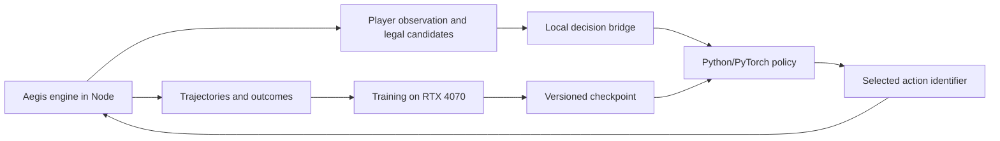

# Local bot training plan for Aegis

Date: 2026-09-26. Inspected baseline: `cae5c3f8b`; desktop validation revision: `0fc8fef8c`. Status: the decision adapter and compact PyTorch/PPO pilot are implemented and have trained on the desktop GPU. Full action/observation coverage, playing strength, and product integration remain incomplete.

The user chose **a strong bot for a few decks first** and authorized testing on the desktop over Tailscale. Train Digimon-specific weights against the Aegis engine, using YGO Agent, Cardsformer, and gym-locm as architectural references. The first release must demonstrate an improvement over the current bot on the selected decks. That result would not establish full-catalog coverage or competitive human-level play.

## Decision and alternatives

| Approach                                                         | Benefit                                                                    | Cost or limitation                                                                               | Decision                                     |
| ---------------------------------------------------------------- | -------------------------------------------------------------------------- | ------------------------------------------------------------------------------------------------ | -------------------------------------------- |
| Compact learned policy, legal-action masks, and varied opponents | Uses the existing engine, supports measurable learning and local inference | Requires a training environment and complete decision coverage                                   | Recommended                                  |
| Search over action sequences with a heuristic evaluator          | Can improve planning without a training dataset                            | Cloning an asynchronous engine with pending choices and hidden information adds substantial work | Later experiment, after measuring the policy |
| Local LLM selecting actions                                      | Quick experiment and textual explanations                                  | Uncertain latency and playing strength; validation and evaluation still required                 | Outside the first release                    |

### What to take from each project

- **YGO Agent:** represent cards, context, and candidate actions; score each candidate against the current state and mask unavailable actions. Its [model](https://github.com/sbl1996/ygo-agent/blob/main/ygoai/rl/jax/agent.py) also uses history and supports recurrent networks. Start without recurrence and add it only if measurements justify it. Its [embedding script](https://github.com/sbl1996/ygo-agent/blob/main/scripts/card/embedding.py) calls Voyage API; Aegis should use structured attributes and optionally generate its own embeddings locally.
- **Cardsformer:** test card text alongside structured attributes, inspired by its [encoder](https://github.com/WannianXia/Cardsformer/blob/main/Algo/encoder.py) and [policy](https://github.com/WannianXia/Cardsformer/blob/main/Model/PolicyModel.py). Initially, text is an optional comparison using frozen, cached vectors. Auxiliary state prediction is deferred. Do not copy implementation or weights without an identified reuse license.
- **gym-locm:** separate environment, training, and evaluation; combine masked actions, fixed opponents, and previous policy versions, as in its [battle trainer](https://github.com/ronaldosvieira/gym-locm/blob/master/gym_locm/toolbox/trainer_battle.py). Its published draft models are not Digimon battle policies.

These projects do not plug directly into one another. YGO Agent declares MIT and Apache-2.0 notices for components; gym-locm declares MIT. Cardsformer is a conceptual reference in this plan. See [the research note](../research-local-tcg-bot.md) for evidence and limitations.

## Deck scope

1. **Infrastructure validation:** use `RED_DECK` and `BLUE_DECK` from [testDecks.ts](../../apps/api/src/engine/testDecks.ts). These are simple test decks, not competitive lists. Compare the new environment with the existing harness.
2. **First useful training run:** the user selected BT26 as the starting format. Use `bt26-dgo-2026-09-05-1-glowing-dawn@1` and `bt26-dgo-2026-09-05-2-abbadomon@1` from the [BT26 catalog](../../packages/shared/src/decks/data/bt26.json), including their cards from earlier sets. Confirm resolved versions, legality, and complete action coverage before freezing the manifest.
3. **Controlled expansion:** add a third and fourth BT26-format list after the first comparison. Include cross-deck matchups and mirrors. Evaluate a deck never used for training separately as a generalization experiment.

These are concrete candidate lists, not a coverage certification. Extend the adapter to support their mechanics; do not replace these lists with easier decks to pass coverage. Registered card effects do not establish that the bot can select every required action. “100% of actions” means every legal action and decision required by the scoped decks is selectable, independently of whether the trained model chooses the strongest move.

## Existing components and required changes

| Existing component                                     | Reuse                                     | Required work                                                                                                        |
| ------------------------------------------------------ | ----------------------------------------- | -------------------------------------------------------------------------------------------------------------------- |
| [BotPolicy](../../apps/api/src/bot/policy.ts)          | Separates strategy from the driver        | Support asynchronous inference while preserving synchronous policies                                                 |
| [BotPlayer](../../apps/api/src/bot/BotPlayer.ts)       | Routes decisions and events               | Cancellable waits, deadlines, and stale-response checks in every decision window                                     |
| [BotView](../../apps/api/src/bot/view.ts)              | Initial player-information boundary       | More complete public stacks, zones, statuses, effects, and observable history                                        |
| [candidates.ts](../../apps/api/src/bot/candidates.ts)  | Initial main-phase action representation  | Engine-authoritative legality and coverage; reconstructed candidates currently omit some actions and can be rejected |
| [matchHarness](../../apps/api/src/bot/matchHarness.ts) | Real seeded matches, results, and metrics | Decision-level stepping, separate termination/truncation, and trajectory recording                                   |
| [benchmark](../../apps/api/src/bot/benchmark.test.ts)  | Reproducible current-bot comparison       | Deck matrix, end-to-end timing, uncertainty estimates, and reserved final evaluation                                 |

The candidate generator does not cover every catalog mechanic; the [meta-deck module](../../apps/api/src/bot/metaDecks/index.ts) explicitly notes missing DigiXros support. Filtering current candidates cannot recover actions that were never enumerated. Share engine validators and projections without speculatively executing actions against a live match.

## Proposed architecture



Run simulation, collection, and training inside the same WSL environment, avoiding a Tailscale round trip per move. Use Tailscale/SSH to transfer a pinned revision, launch jobs, and retrieve results. Test production inference on the intended deployment hardware too; the desktop should not become a permanent dependency of online matches.

### Environment and protocol

Build a sequential two-player adapter inspired by [PettingZoo AEC](https://pettingzoo.farama.org/api/aec/), exposing `reset(seed, deckManifest)`, `observe(seat)`, `step(decisionId, actionId)`, and `close()`. A step advances to the next decision for either player or the end of the match. One action is not one turn: the same player may act repeatedly, and the opponent may respond during that turn.

Start with versioned JSON messages over local pipes. Include `episodeId`, `decisionId`, the acting player, observation, candidates, and mask. Node owns the private mapping from opaque action identifiers to `Intent`. The model selects an identifier instead of inventing command fields. An old response must never act on a new episode or decision window.

Cover breeding, main-phase actions, effect choices and ordering, target subsets, costs, and combat responses. Include setup and mulligan where the engine exposes them. Represent combinatorial choices as constrained subdecisions with an explicit finish action, enforcing minimum/maximum counts and joint restrictions. Do not enumerate unlimited subsets or treat invalid combinations as legal actions.

First implement a Gymnasium wrapper against a frozen opponent: after the learner acts, advance the opponent's decisions until control returns. This supports MaskablePPO without pretending one update trains both seats simultaneously. Alternate the learner's seat across episodes. Then add a pool of earlier checkpoints as opponents.

### Observations, actions, and model

- Expose the player's hand; public board, evolution stacks, and trash; costs, DP, levels, colors, traits, statuses, memory, hidden-zone sizes, and permitted history. Preserve knowledge gained through legitimate reveals. Never expose actual deck order or unrevealed cards.
- Give both the initial policy and value evaluator only this observation. Test states differing solely in information unknown to the player: their observations and visible choices should agree whenever the player has no distinguishing knowledge.
- Version card IDs, rules, catalog, observation schema, and action encoding. Use episode-local instance references; do not let global identifiers become learning shortcuts.
- First neural baseline: structured attributes, bounded public-history summary, and a feed-forward policy. Next, implement a custom head that scores contextualized candidates, inspired by YGO Agent. Compare them under the same budget and opponents.
- The first discrete action space uses masked candidate slots with an explicit capacity measured against the corpus. Treat overflow as a coverage failure, never silently discard actions. The contextual policy should read candidate attributes rather than rely only on list positions.
- Cardsformer experiment: compare the same policy with and without locally generated text embeddings cached by card version. Do not assume text or a transformer improves win rate.
- [Stock MaskablePPO does not support recurrent policies](https://sb3-contrib.readthedocs.io/en/master/modules/ppo_mask.html). Masked LSTM/GRU policies require additional implementation and tests; recurrence is not a switch in the first baseline.

### Training and integration

Imitating the current policies initializes behavior but does not establish improvement. Begin with terminal rewards: win `+1`, loss `-1`, rules-defined draw `0`. Avoid repeatedly rewarding attacks, draws, or evolution, which could incentivize loops. Distinguish turn-limit truncations and simulator errors from actual draws; otherwise the agent may learn to exploit artificial endings.

Experiment with masked PPO against the current bot and a small population of frozen checkpoints. Keep previous opponents to detect regressions and excessive specialization. Separate training, checkpoint-selection, and final-evaluation seeds. Group paired episodes together when estimating uncertainty.

Integrate inference through a persistent Python process first. Await it without blocking Node's event loop, enforce a deadline, and confirm the decision is still current. On failure, fall back to the validated heuristic policy. Count fallbacks explicitly during evaluation so the model does not receive credit for the old bot's decisions. Defer ONNX or another runtime export until output parity and measurable benefit are established.

## Desktop inspection and preparation

Inspected through SSH alias `desktop`, Tailscale host `desktop-siuili7`, Ubuntu WSL2. Use Linux user `vinicius`.

| Item                     | Observation                                                                                       |
| ------------------------ | ------------------------------------------------------------------------------------------------- |
| Network                  | Direct Tailscale ping of 5 ms; SSH and WSL commands succeeded                                     |
| CPU                      | AMD Ryzen 7 5700X, 8 cores / 16 threads                                                           |
| Physical RAM             | 15.9 GiB                                                                                          |
| GPU                      | NVIDIA GeForce RTX 4070, 12,282 MiB, driver 591.86                                                |
| WSL                      | Ubuntu, kernel 6.18.33.2; approximately 7.9 GiB RAM visible to the VM                             |
| Physical Windows storage | Approximately 371 GiB free; the larger virtual WSL disk capacity is not physical free space       |
| Initial load             | GPU utilization 100%; approximately 124 MiB available WSL memory and 12.6 GiB swap used           |
| Existing workload        | Pixal3D Python process, approximately 6.8 GiB RSS, identified by executable and working directory |
| Existing toolchain       | Node 22.22.1; Corepack's pnpm resolution failed; system Python 3.14.4                             |
| Existing checkout        | `/home/vinicius/aegis-digimon-tcg`, revision `6f29328b`, different from the local baseline        |

These are point-in-time observations, not agent performance measurements. The isolated lab is `/home/vinicius/aegis-bot-lab`, separate from the existing checkout and Pixal3D environment.

**Completed on the desktop:** downloaded Node 26.10.0, verified its archive against the official SHA-256 manifest, installed pnpm 10.30.1 in the lab, and passed a basic Node runtime smoke check. These versions match the repository's [requirements](../../package.json). The lab's `env.sh` selects them without changing system tools or shell startup files.

The initial remote report is `runs/2026-09-26-preflight/report.json` under the lab. Its final check at `2026-09-27T01:41:42Z` (2026-09-26 locally) observed approximately 439 MiB available WSL memory, below the proposed 2 GiB engine-smoke threshold. At that time, engine benchmarks and CUDA tests were not run. This resource limitation was cleared after the user stopped the other workload; the subsequent validation is recorded below.

Use the separate Python 3.12 virtual environment prepared below. Do not reuse the other project's Python environment. Require enough free resources before each performance run. Do not terminate unrelated processes, change drivers, resize WSL, or reboot the desktop for this experiment.

Begin with one PyTorch CPU thread and up to four simulators, based on the bounded measurements below. Recheck memory when adding neural inference, longer trajectories, or complex decks. Require roughly 2 GiB available memory before the engine smoke test, then size training against measured RSS. With 16 GiB physical RAM, simulation CPU/RAM may constrain throughput before GPU capacity does.

### Validation after the competing workload stopped

Validated on 2026-09-26 locally, ending around `2026-09-27T02:02Z`. Before testing, WSL had 7,195 MiB available memory, no swap usage, and the idle GPU used 374 MiB. After all jobs exited, WSL had 7,272 MiB available, swap remained unused, and GPU utilization returned to 0% with 389 MiB used. No long-running training job was left behind.

An isolated source snapshot of revision `0fc8fef8c9e966a2213f9482196210acb9f126ef` is in `checkouts/0fc8fef8c` under the lab. Its archive SHA-256 is `0e50bb26789a3e12b933ef3a9b9d1d9653057c1198328711bcbbe2fbdeb89af0`. The archive contains the API, shared package, required data/tools/configuration, and the web package manifest for workspace resolution. Installation used the frozen pnpm lockfile with lifecycle scripts disabled. Both shared and API builds succeeded.

| Check                    | Observed result                                                                                                                                                                                      |
| ------------------------ | ---------------------------------------------------------------------------------------------------------------------------------------------------------------------------------------------------- |
| Bot and projection tests | `benchmark.test.ts` and `matchHarness.projections.test.ts`: 5 tests passed; test-run duration 5.23 seconds                                                                                           |
| CUDA training            | Python 3.12.14, PyTorch 2.7.1+cu128, CUDA runtime 12.8; 200 optimizer steps on a synthetic 185,089-parameter candidate-scoring network passed                                                        |
| CUDA computation         | Batch size 128 with 64 candidate actions; training loop took 0.617 seconds; cross-entropy fell from 3.867 to 0.000191 on the fixed synthetic batch                                                   |
| CUDA inference           | 200 measured single-observation calls after warmup: p50 0.467 ms, p95 0.519 ms, including host/device transfers but excluding any engine or IPC work                                                 |
| CUDA correctness         | Finite final gradients/loss, legal masked selections, and checkpoint save/reload parity passed; PyTorch peak reserved memory was 68 MiB, excluding driver/context overhead                           |
| PPO library integration  | Stable-Baselines3 2.7.0, sb3-contrib 2.7.0, Gymnasium 1.2.0; MaskablePPO completed 1,024 CPU training steps on its synthetic environment, 128 valid masked predictions, and checkpoint reload parity |

The synthetic tests validate the software/hardware path. They do not measure Digimon learning, generalization, or the future model's latency. The fixed-batch loss reduction is deliberately an overfitting smoke test, not evidence of playing strength. CPU PPO and CUDA policy training were checked separately; simultaneous end-to-end rollout collection and GPU optimization remain to be measured after the environment exists.

Headless throughput used the current balanced policies with the simple red/blue decks. Each configuration ran 80 measured matches, plus two warmup matches per worker:

| Workers | Measured matches / wall second | Wall time including import and warmup | Sum of worker peak RSS | Minimum available WSL memory |
| ------- | ------------------------------ | ------------------------------------- | ---------------------- | ---------------------------- |
| 1       | 6.96                           | 11.49 s                               | 361 MiB                | 6,872 MiB                    |
| 2       | 11.69                          | 6.84 s                                | 661 MiB                | 6,614 MiB                    |
| 4       | 14.78                          | 5.41 s                                | 1,237 MiB              | 6,064 MiB                    |

All 240 measured matches ended with a winner, zero errors, and zero rejected actions. Warmup games are excluded from those 240 outcomes. The separate smoke suite intentionally includes a legacy baseline that still rejects some actions; its expected legacy rejections are not failures of the measured balanced-policy throughput run.

These short samples use different seed allocations across worker counts, so they are feasibility measurements rather than a controlled scaling study. Summed per-worker peak RSS is not a simultaneous process-memory measurement. The selected BT26 decks and a learned policy were not exercised in this initial throughput check. An initial four-worker budget is reasonable for this baseline; reduce it if the actual training workload increases memory pressure.

Artifacts are in `/home/vinicius/aegis-bot-lab/runs/2026-09-26-validation/`: `cuda-smoke.py`, `cuda-smoke.json`, `ppo-smoke.py`, `ppo-smoke.json`, `throughput.mjs`, `throughput.json`, build/test/install logs, synthetic checkpoints, and `python-requirements.txt`. The Python environment is `/home/vinicius/aegis-bot-lab/venv`; all installed package versions were recorded. The throughput launcher was corrected to distinguish its result record from engine log lines before the successful measurement.

To repeat the bounded checks inside the desktop's WSL:

```sh
source /home/vinicius/aegis-bot-lab/env.sh
/home/vinicius/aegis-bot-lab/venv/bin/python /home/vinicius/aegis-bot-lab/runs/2026-09-26-validation/cuda-smoke.py
/home/vinicius/aegis-bot-lab/venv/bin/python /home/vinicius/aegis-bot-lab/runs/2026-09-26-validation/ppo-smoke.py
node /home/vinicius/aegis-bot-lab/runs/2026-09-26-validation/throughput.mjs
```

**Readiness decision:** the desktop is suitable for implementing and testing the planned compact Digimon agent. Phase 0's hardware/runtime checks are complete. The next dependency is the Aegis decision-level training environment and deck coverage, not more hardware provisioning.

### BT26 baseline and privacy prerequisite

After the user stopped the other workload, a fresh desktop check found 7,251 MiB available in WSL, zero swap use, and 374 MiB GPU memory used at 0% utilization. The isolated lab remains suitable for the planned compact model.

The selected Glowing Dawn and Abbadomon decks were exercised with the existing balanced heuristic, using 25 seeds for each of the four ordered pairings, including mirrors. The original baseline stopped after game 79: Abbadomon mirror seed `262603` exposed opponent hand entries through the client projection. A later rerun identified the same class of failure at seed `262613`. A card recovered from trash and discarded again retained stale Colyseus collection ancestry; revealing it could grant visibility to the old hand collection and subsequent draws. The repair removes collection parents that no longer contain that card before visibility propagation. Both seeds now have regression tests, including checks that recovery, discard, and a later draw actually occur.

The final desktop run completed all 100 games in 51.73 seconds: 98 security wins, two deck-out wins, no truncations, no rejected intents, and no errors reported by the harness across 8,621 projection checks. **This is not a clean simulator acceptance result:** the decoder also logged 191 `refId` warnings, which the harness does not currently promote to errors. Such warnings occur on the original source too; their remaining cause and any output corruption need investigation before trusting decoded observations for training. Completing games and passing the current privacy assertions does not establish complete observation correctness or action coverage.

The desktop's Node 26 build and API typecheck pass. The final focused/bot/fuzzer run passes 285 tests, with a decoder warning still present in the regression-test log. A broader preliminary run found an existing source-guard failure in `syncedArrayMutators.guard.test.ts` (`ordered.splice(index, 0, permanent)`); that failure was independently reproduced on the untouched baseline. The 43 focused visibility/projection tests also pass locally. Standards and spec reviews found no blocking issues in the privacy repair.

Evidence lives under `/home/vinicius/aegis-bot-lab/runs/2026-09-26-bt26-patched-v2/`: `report.json`, `run.mjs`, `run.log`, build/typecheck/test logs, and the exact source overlay with SHA-256 hashes. The checkout is `/home/vinicius/aegis-bot-lab/checkouts/bt26-privacy-fix`, based on `0fc8fef8c` plus the repair committed as `a72f5cd2b`. Earlier failing runs remain in the adjacent `2026-09-26-bt26-baseline` and `2026-09-26-bt26-patched` directories. This baseline preceded the learned-policy pilots described below.

### Executable GPU pilot (2026-09-27)

The first adapter/PPO implementation now runs both pinned BT26 lists through the real engine. It enumerates validated main and breeding actions, exposes all offered combat responses, and decomposes selections and ordering into sequential choices without truncating candidate lists. Tests exercise alternate Glowing Dawn evolution, Negamon's breeding ability, joint selection constraints, hidden-information isolation, and small complete ordering trees. These are partial mechanism proofs; they do not certify every card branch. Persistent reveal history and comprehensive status/keyword features remain observation work.

The updated desktop checkout is `/home/vinicius/aegis-bot-lab/checkouts/bt26-training-v2`; evidence is `/home/vinicius/aegis-bot-lab/runs/2026-09-27-training-v2`. Node 26 build/typecheck and 44 targeted TypeScript tests pass. Four Python tests cover identifier-renaming invariance, selection order, padding masks/finite gradients, and cleanup after worker initialization failure. Standards/spec review findings were fixed: multicolor choices now use the engine's distinct-color assignment rule, startup resources are exception-safe, and checkpoint fingerprints cover shared executable rules and the dependency lockfile.

- CUDA training: seeds `280000–280015`, 16 games, 543 learner decisions, 40.98 seconds, one win, 15 losses, no invalid or truncated episodes. Weights changed (maximum absolute parameter delta `0.0079384`) and checkpoint reload was exact.
- Greedy evaluation: separate seeds `390000–390007`, eight games, zero wins, seven losses, one explicit 512-decision truncation. This is development evaluation, not the reserved final comparison. Repeated legal no-progress choices remain a policy failure; the adapter does not remove legal choices to conceal it.
- Engine fingerprint: `5a2beadd636eb7d80ae863981b03a4924c1909c164f32fafe7a0a75a0d866ea0`. A temporary change to shared runtime code changed the fingerprint; restoring the bytes restored the original fingerprint.
- Exact uploaded source archive: `/home/vinicius/aegis-bot-lab/training-v2-source.tgz`, SHA-256 `d9b1c6c9cf7e5a2772dcd179e57f1c83926cc30f19d50cf21d3ee2f7120f4d60`, layered on the archived v1 checkout. Logs, configuration, episode outcomes, checkpoint, and verification JSON remain in the run directory. A later local edit only clarified test assertion diagnostics.

The earlier pilot remains archived at `2026-09-26-training-pilot`: 16 games, 550 decisions, one win, exact checkpoint reload. Its first feature schema and fingerprint format are incompatible with v2. Neither pilot meets the strength or complete-coverage acceptance gates. Next: mechanism-by-mechanism coverage, competent demonstration collection/imitation, stronger evaluation, and opt-in asynchronous inference.

### Public decision context (feature schema 3)

The numeric model inputs now distinguish 18 engine-projected public status flags, explicit keyword identities, security-attack counts, breeding/entry state, and per-seat board summaries. Blocking includes whether the attack targets a player or Digimon and whether blocking is compulsory. Reveal metadata fills previously anonymous identities while retaining live DP and statuses for already-known cards. Keyword features use the engine vocabulary rather than hashed text: review found that the former hash mapped Alliance and Barrier to the same vector. Unexpected keyword names now fail explicitly.

The reviewed implementation is archived in `/home/vinicius/aegis-bot-lab/checkouts/bt26-training-v3-verified`, with evidence in `/home/vinicius/aegis-bot-lab/runs/2026-09-27-training-v3-verified`. Node 26 build/typecheck, 16 focused TypeScript tests, and eight Python tests pass. The CUDA smoke completed seeds `310000–310007`: eight complete games, 348 decisions, zero wins, eight losses, no rejections or truncations, 20.85 seconds. Maximum parameter change was `0.0036538`; checkpoint reload was exact. This run verifies the revised inputs and learning mechanics, not improved playing strength. The uploaded source archive SHA-256 is `9a3e194172de0fac9093708ab61f8908542454edee5bd2fbd428d8f445993ff2` (`training-v3-verified-source.tgz`, layered on v2). Earlier v3 development runs remain archived separately and are not the evidence for the reviewed code.

Observation schema 2 / feature schema 3 intentionally invalidate earlier checkpoints. The desktop rejected the v2 checkpoint before starting an episode (`compatibility-check.json`). The verified engine fingerprint is `34049290a93961cf0a5725735073ceb2a21d4ea9f78bcd49b99356b3a14e5fa0`. Remaining observation gaps include persistent permitted reveal/history information and the specific attacked permanent during blocking. Complete card-mechanic coverage, demonstration/imitation training, stronger evaluation, and product inference remain open.

## Milestones and acceptance criteria

| Phase                             | Deliverable                                                                       | Verification                                                                                                                  |
| --------------------------------- | --------------------------------------------------------------------------------- | ----------------------------------------------------------------------------------------------------------------------------- |
| 0. Lab                            | Isolated revision, pinned tools, hardware/run manifest                            | SSH and runtime checks; PyTorch import and short CUDA operation; build and bot smoke; games/second and RSS with 1/2/4 workers |
| 1. Coverage and environment       | Complete observations, decision stepping, candidates, and masks for the two decks | Deterministic-sequence equivalence with the harness; hidden-information, joint-choice, termination, and decision-window tests |
| 2. Collection and neural baseline | Versioned trajectories and an imitation model                                     | Trajectory replay, format validation, episode-level splits, and approximate teacher parity without claiming improvement       |
| 3. Reinforcement learning         | Masked PPO against fixed and previous opponents                                   | Bounded learning pilot, recoverable checkpoints, curves by training seed, and no exploitation of engine errors                |
| 4. Comparisons                    | Contextual scoring; optional frozen text; recurrence later                        | Equal decision budgets and checkpoint-selection sets; retain extra complexity only with consistent gains                      |
| 5. Final evaluation and product   | Reserved-match report and opt-in asynchronous integration                         | Criteria below; timeout/stale-response checks; deployment-host latency; current bot retained as fallback                      |

Suggested locations: `apps/api/src/bot/training/` for the environment and observations; `apps/api/src/bot/` for inference integration; `tools/bot-training/` for Python training and configuration; Git-ignored `artifacts/bot-training/` for datasets, checkpoints, and logs. Each remote run records source SHA, deck/catalog hashes, versions, configuration, and seeds. Transfer only the required source files, never credentials or production data. Training evidence does not belong under `docs/audits/`; any card fixes must follow the existing collection ledgers and IR registration rules.

### Proposed first-release gates

- **Coverage:** every decision required by the two lists is available; no silent overflow, hidden-information leak, or invalid action in the acceptance set.
- **Reliability:** 1,000 robustness games without exceptions or deadlocks. Report natural termination, turn limit, timeout, error, and fallback separately. This batch does not replace strength evaluation.
- **Strength:** at least 1,000 reserved final-evaluation games, allocated in advance across matchups and sides. Target at least 60% of match points (`win=1`, `draw=0.5`) against the current policy, with the lower bound of a 95% confidence interval above 50%. Use paired-seed groups for uncertainty, and report wins/draws/losses and each matchup. Claim improvement on both decks only with supporting per-deck evidence; increase sample size if inconclusive. Do not select checkpoints using the final set.
- **Latency:** initial p95 targets of 250 ms for main-phase decisions and 100 ms for combat responses, excluding animations but including serialization and inference. Measure end to end rather than reuse only the current synchronous timer. Start with a configurable timeout ceiling of 1 s, lowered where the game window requires it. Confirm targets on the deployment host.
- **Learning:** at least three training seeds to distinguish consistent improvement from a fortunate checkpoint. Do not claim coverage or strength outside the declared decks and evaluation conditions.

### Bounded experiments before a long run

1. Measure a short current-bot batch with initialization separated from match time, using the simple red/blue decks to validate infrastructure.
2. Run 100 games on the selected training decks and freeze the first baseline matrix. Resolve structural failures before collection.
3. Collect an initial batch of up to 1,000 games from varied policies, adjusting to actual trajectory size. This volume is an experiment, not a promised requirement for strong play.
4. Run a training pilot capped at 30 minutes, with memory limits and periodic checkpoints, to verify gradients, masking, recovery, and resource use. This is not a strength milestone.
5. Estimate the next budget from measured decisions per second: `collection time ≈ target decisions / measured throughput`, then add measured optimization, evaluation, and I/O time. Do not estimate training duration from VRAM alone.

## Commands and resumption

Verify the isolated desktop tools:

```sh
ssh desktop 'wsl -d Ubuntu -u vinicius -- bash -lc "source /home/vinicius/aegis-bot-lab/env.sh; node --version; pnpm --version"'
```

The following build/test commands already exist. Executable training and evaluation commands are documented in [the pilot README](../../tools/bot-training/README.md). Run from an isolated checkout of the selected revision with the lab environment loaded:

```sh
pnpm install --frozen-lockfile
pnpm --filter @aegis/shared build
pnpm --filter @aegis/api exec vitest run src/bot/benchmark.test.ts --maxWorkers=1 --no-file-parallelism
pnpm --filter @aegis/api exec vitest run src/bot/matchHarness.projections.test.ts --maxWorkers=1 --no-file-parallelism
pnpm --filter @aegis/api bench:bot --maxWorkers=1 --no-file-parallelism
```

The existing benchmark measures current policies, not a trained model, and does not certify complete action coverage for the selected BT26 lists. Run the larger batch only after the smoke passes and the machine has capacity. The older desktop checkout cannot substantiate claims about the current revision.

**Next executable steps:** finish the per-mechanic action and observation coverage proofs for both decks, collect competent demonstrations for imitation initialization, and measure reliable checkpoint play before opt-in inference integration. The working PPO pilot establishes learning infrastructure, not release readiness.
