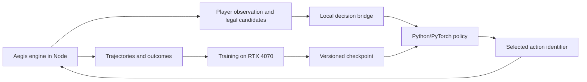

# Local bot training plan for Aegis

Date: 2026-09-26. Inspected baseline: `cae5c3f8b`; desktop validation revision: `0fc8fef8c`. Status: the decision adapter and compact PyTorch/PPO pilot are implemented and have trained on the desktop GPU. Full action/observation coverage, playing strength, and product integration remain incomplete.

The user chose **a strong bot for a few decks first** and authorized testing on the desktop over Tailscale. Train Digimon-specific weights against the Aegis engine, using YGO Agent, Cardsformer, and gym-locm as architectural references. The first release must demonstrate an improvement over the current bot on the selected decks. That result would not establish full-catalog coverage or competitive human-level play.

## Decision and alternatives

| Approach                                                         | Benefit                                                                    | Cost or limitation                                                                               | Decision                                     |
| ---------------------------------------------------------------- | -------------------------------------------------------------------------- | ------------------------------------------------------------------------------------------------ | -------------------------------------------- |
| Compact learned policy, legal-action masks, and varied opponents | Uses the existing engine, supports measurable learning and local inference | Requires a training environment and complete decision coverage                                   | Recommended                                  |
| Search over action sequences with a heuristic evaluator          | Can improve planning without a training dataset                            | Cloning an asynchronous engine with pending choices and hidden information adds substantial work | Later experiment, after measuring the policy |
| Local LLM selecting actions                                      | Quick experiment and textual explanations                                  | Uncertain latency and playing strength; validation and evaluation still required                 | Outside the first release                    |

### What to take from each project

- **YGO Agent:** represent cards, context, and candidate actions; score each candidate against the current state and mask unavailable actions. Its [model](https://github.com/sbl1996/ygo-agent/blob/main/ygoai/rl/jax/agent.py) also uses history and supports recurrent networks. Start without recurrence and add it only if measurements justify it. Its [embedding script](https://github.com/sbl1996/ygo-agent/blob/main/scripts/card/embedding.py) calls Voyage API; Aegis should use structured attributes and optionally generate its own embeddings locally.
- **Cardsformer:** test card text alongside structured attributes, inspired by its [encoder](https://github.com/WannianXia/Cardsformer/blob/main/Algo/encoder.py) and [policy](https://github.com/WannianXia/Cardsformer/blob/main/Model/PolicyModel.py). Initially, text is an optional comparison using frozen, cached vectors. Auxiliary state prediction is deferred. Do not copy implementation or weights without an identified reuse license.
- **gym-locm:** separate environment, training, and evaluation; combine masked actions, fixed opponents, and previous policy versions, as in its [battle trainer](https://github.com/ronaldosvieira/gym-locm/blob/master/gym_locm/toolbox/trainer_battle.py). Its published draft models are not Digimon battle policies.

These projects do not plug directly into one another. YGO Agent declares MIT and Apache-2.0 notices for components; gym-locm declares MIT. Cardsformer is a conceptual reference in this plan. See [the research note](../research-local-tcg-bot.md) for evidence and limitations.

## Deck scope

1. **Infrastructure validation:** use `RED_DECK` and `BLUE_DECK` from [testDecks.ts](../../apps/api/src/engine/testDecks.ts). These are simple test decks, not competitive lists. Compare the new environment with the existing harness.
2. **First useful training run:** the user selected BT26 as the starting format. Use `bt26-dgo-2026-09-05-1-glowing-dawn@1` and `bt26-dgo-2026-09-05-2-abbadomon@1` from the [BT26 catalog](../../packages/shared/src/decks/data/bt26.json), including their cards from earlier sets. Confirm resolved versions, legality, and complete action coverage before freezing the manifest.
3. **Controlled expansion:** add a third and fourth BT26-format list after the first comparison. Include cross-deck matchups and mirrors. Evaluate a deck never used for training separately as a generalization experiment.

These are concrete candidate lists, not a coverage certification. Extend the adapter to support their mechanics; do not replace these lists with easier decks to pass coverage. Registered card effects do not establish that the bot can select every required action. “100% of actions” means every legal action and decision required by the scoped decks is selectable, independently of whether the trained model chooses the strongest move.

## Existing components and required changes

| Existing component                                     | Reuse                                     | Required work                                                                                                        |
| ------------------------------------------------------ | ----------------------------------------- | -------------------------------------------------------------------------------------------------------------------- |
| [BotPolicy](../../apps/api/src/bot/policy.ts)          | Separates strategy from the driver        | Support asynchronous inference while preserving synchronous policies                                                 |
| [BotPlayer](../../apps/api/src/bot/BotPlayer.ts)       | Routes decisions and events               | Cancellable waits, deadlines, and stale-response checks in every decision window                                     |
| [BotView](../../apps/api/src/bot/view.ts)              | Initial player-information boundary       | More complete public stacks, zones, statuses, effects, and observable history                                        |
| [candidates.ts](../../apps/api/src/bot/candidates.ts)  | Initial main-phase action representation  | Engine-authoritative legality and coverage; reconstructed candidates currently omit some actions and can be rejected |
| [matchHarness](../../apps/api/src/bot/matchHarness.ts) | Real seeded matches, results, and metrics | Decision-level stepping, separate termination/truncation, and trajectory recording                                   |
| [benchmark](../../apps/api/src/bot/benchmark.test.ts)  | Reproducible current-bot comparison       | Deck matrix, end-to-end timing, uncertainty estimates, and reserved final evaluation                                 |

The candidate generator does not cover every catalog mechanic; the [meta-deck module](../../apps/api/src/bot/metaDecks/index.ts) explicitly notes missing DigiXros support. Filtering current candidates cannot recover actions that were never enumerated. Share engine validators and projections without speculatively executing actions against a live match.

## Proposed architecture



Run simulation, collection, and training inside the same WSL environment, avoiding a Tailscale round trip per move. Use Tailscale/SSH to transfer a pinned revision, launch jobs, and retrieve results. Test production inference on the intended deployment hardware too; the desktop should not become a permanent dependency of online matches.

### Environment and protocol

Build a sequential two-player adapter inspired by [PettingZoo AEC](https://pettingzoo.farama.org/api/aec/), exposing `reset(seed, deckManifest)`, `observe(seat)`, `step(decisionId, actionId)`, and `close()`. A step advances to the next decision for either player or the end of the match. One action is not one turn: the same player may act repeatedly, and the opponent may respond during that turn.

Start with versioned JSON messages over local pipes. Include `episodeId`, `decisionId`, the acting player, observation, candidates, and mask. Node owns the private mapping from opaque action identifiers to `Intent`. The model selects an identifier instead of inventing command fields. An old response must never act on a new episode or decision window.

Cover breeding, main-phase actions, effect choices and ordering, target subsets, costs, and combat responses. Include setup and mulligan where the engine exposes them. Represent combinatorial choices as constrained subdecisions with an explicit finish action, enforcing minimum/maximum counts and joint restrictions. Do not enumerate unlimited subsets or treat invalid combinations as legal actions.

First implement a Gymnasium wrapper against a frozen opponent: after the learner acts, advance the opponent's decisions until control returns. This supports MaskablePPO without pretending one update trains both seats simultaneously. Alternate the learner's seat across episodes. Then add a pool of earlier checkpoints as opponents.

### Observations, actions, and model

- Expose the player's hand; public board, evolution stacks, and trash; costs, DP, levels, colors, traits, statuses, memory, hidden-zone sizes, and permitted history. Preserve knowledge gained through legitimate reveals. Never expose actual deck order or unrevealed cards.
- Give both the initial policy and value evaluator only this observation. Test states differing solely in information unknown to the player: their observations and visible choices should agree whenever the player has no distinguishing knowledge.
- Version card IDs, rules, catalog, observation schema, and action encoding. Use episode-local instance references; do not let global identifiers become learning shortcuts.
- First neural baseline: structured attributes, bounded public-history summary, and a feed-forward policy. Next, implement a custom head that scores contextualized candidates, inspired by YGO Agent. Compare them under the same budget and opponents.
- The first discrete action space uses masked candidate slots with an explicit capacity measured against the corpus. Treat overflow as a coverage failure, never silently discard actions. The contextual policy should read candidate attributes rather than rely only on list positions.
- Cardsformer experiment: compare the same policy with and without locally generated text embeddings cached by card version. Do not assume text or a transformer improves win rate.
- [Stock MaskablePPO does not support recurrent policies](https://sb3-contrib.readthedocs.io/en/master/modules/ppo_mask.html). Masked LSTM/GRU policies require additional implementation and tests; recurrence is not a switch in the first baseline.

### Training and integration

Imitating the current policies initializes behavior but does not establish improvement. Begin with terminal rewards: win `+1`, loss `-1`, rules-defined draw `0`. Avoid repeatedly rewarding attacks, draws, or evolution, which could incentivize loops. Distinguish turn-limit truncations and simulator errors from actual draws; otherwise the agent may learn to exploit artificial endings.

Experiment with masked PPO against the current bot and a small population of frozen checkpoints. Keep previous opponents to detect regressions and excessive specialization. Separate training, checkpoint-selection, and final-evaluation seeds. Group paired episodes together when estimating uncertainty.

Integrate inference through a persistent Python process first. Await it without blocking Node's event loop, enforce a deadline, and confirm the decision is still current. On failure, fall back to the validated heuristic policy. Count fallbacks explicitly during evaluation so the model does not receive credit for the old bot's decisions. Defer ONNX or another runtime export until output parity and measurable benefit are established.

## Desktop inspection and preparation

Inspected through SSH alias `desktop`, Tailscale host `desktop-siuili7`, Ubuntu WSL2. Use Linux user `vinicius`.

| Item                     | Observation                                                                                       |
| ------------------------ | ------------------------------------------------------------------------------------------------- |
| Network                  | Direct Tailscale ping of 5 ms; SSH and WSL commands succeeded                                     |
| CPU                      | AMD Ryzen 7 5700X, 8 cores / 16 threads                                                           |
| Physical RAM             | 15.9 GiB                                                                                          |
| GPU                      | NVIDIA GeForce RTX 4070, 12,282 MiB, driver 591.86                                                |
| WSL                      | Ubuntu, kernel 6.18.33.2; approximately 7.9 GiB RAM visible to the VM                             |
| Physical Windows storage | Approximately 371 GiB free; the larger virtual WSL disk capacity is not physical free space       |
| Initial load             | GPU utilization 100%; approximately 124 MiB available WSL memory and 12.6 GiB swap used           |
| Existing workload        | Pixal3D Python process, approximately 6.8 GiB RSS, identified by executable and working directory |
| Existing toolchain       | Node 22.22.1; Corepack's pnpm resolution failed; system Python 3.14.4                             |
| Existing checkout        | `/home/vinicius/aegis-digimon-tcg`, revision `6f29328b`, different from the local baseline        |

These are point-in-time observations, not agent performance measurements. The isolated lab is `/home/vinicius/aegis-bot-lab`, separate from the existing checkout and Pixal3D environment.

**Completed on the desktop:** downloaded Node 26.10.0, verified its archive against the official SHA-256 manifest, installed pnpm 10.30.1 in the lab, and passed a basic Node runtime smoke check. These versions match the repository's [requirements](../../package.json). The lab's `env.sh` selects them without changing system tools or shell startup files.

The initial remote report is `runs/2026-09-26-preflight/report.json` under the lab. Its final check at `2026-09-27T01:41:42Z` (2026-09-26 locally) observed approximately 439 MiB available WSL memory, below the proposed 2 GiB engine-smoke threshold. At that time, engine benchmarks and CUDA tests were not run. This resource limitation was cleared after the user stopped the other workload; the subsequent validation is recorded below.

Use the separate Python 3.12 virtual environment prepared below. Do not reuse the other project's Python environment. Require enough free resources before each performance run. Do not terminate unrelated processes, change drivers, resize WSL, or reboot the desktop for this experiment.

Begin with one PyTorch CPU thread and up to four simulators, based on the bounded measurements below. Recheck memory when adding neural inference, longer trajectories, or complex decks. Require roughly 2 GiB available memory before the engine smoke test, then size training against measured RSS. With 16 GiB physical RAM, simulation CPU/RAM may constrain throughput before GPU capacity does.

### Validation after the competing workload stopped

Validated on 2026-09-26 locally, ending around `2026-09-27T02:02Z`. Before testing, WSL had 7,195 MiB available memory, no swap usage, and the idle GPU used 374 MiB. After all jobs exited, WSL had 7,272 MiB available, swap remained unused, and GPU utilization returned to 0% with 389 MiB used. No long-running training job was left behind.

An isolated source snapshot of revision `0fc8fef8c9e966a2213f9482196210acb9f126ef` is in `checkouts/0fc8fef8c` under the lab. Its archive SHA-256 is `0e50bb26789a3e12b933ef3a9b9d1d9653057c1198328711bcbbe2fbdeb89af0`. The archive contains the API, shared package, required data/tools/configuration, and the web package manifest for workspace resolution. Installation used the frozen pnpm lockfile with lifecycle scripts disabled. Both shared and API builds succeeded.

| Check                    | Observed result                                                                                                                                                                                      |
| ------------------------ | ---------------------------------------------------------------------------------------------------------------------------------------------------------------------------------------------------- |
| Bot and projection tests | `benchmark.test.ts` and `matchHarness.projections.test.ts`: 5 tests passed; test-run duration 5.23 seconds                                                                                           |
| CUDA training            | Python 3.12.14, PyTorch 2.7.1+cu128, CUDA runtime 12.8; 200 optimizer steps on a synthetic 185,089-parameter candidate-scoring network passed                                                        |
| CUDA computation         | Batch size 128 with 64 candidate actions; training loop took 0.617 seconds; cross-entropy fell from 3.867 to 0.000191 on the fixed synthetic batch                                                   |
| CUDA inference           | 200 measured single-observation calls after warmup: p50 0.467 ms, p95 0.519 ms, including host/device transfers but excluding any engine or IPC work                                                 |
| CUDA correctness         | Finite final gradients/loss, legal masked selections, and checkpoint save/reload parity passed; PyTorch peak reserved memory was 68 MiB, excluding driver/context overhead                           |
| PPO library integration  | Stable-Baselines3 2.7.0, sb3-contrib 2.7.0, Gymnasium 1.2.0; MaskablePPO completed 1,024 CPU training steps on its synthetic environment, 128 valid masked predictions, and checkpoint reload parity |

The synthetic tests validate the software/hardware path. They do not measure Digimon learning, generalization, or the future model's latency. The fixed-batch loss reduction is deliberately an overfitting smoke test, not evidence of playing strength. CPU PPO and CUDA policy training were checked separately; simultaneous end-to-end rollout collection and GPU optimization remain to be measured after the environment exists.

Headless throughput used the current balanced policies with the simple red/blue decks. Each configuration ran 80 measured matches, plus two warmup matches per worker:

| Workers | Measured matches / wall second | Wall time including import and warmup | Sum of worker peak RSS | Minimum available WSL memory |
| ------- | ------------------------------ | ------------------------------------- | ---------------------- | ---------------------------- |
| 1       | 6.96                           | 11.49 s                               | 361 MiB                | 6,872 MiB                    |
| 2       | 11.69                          | 6.84 s                                | 661 MiB                | 6,614 MiB                    |
| 4       | 14.78                          | 5.41 s                                | 1,237 MiB              | 6,064 MiB                    |

All 240 measured matches ended with a winner, zero errors, and zero rejected actions. Warmup games are excluded from those 240 outcomes. The separate smoke suite intentionally includes a legacy baseline that still rejects some actions; its expected legacy rejections are not failures of the measured balanced-policy throughput run.

These short samples use different seed allocations across worker counts, so they are feasibility measurements rather than a controlled scaling study. Summed per-worker peak RSS is not a simultaneous process-memory measurement. The selected BT26 decks and a learned policy were not exercised in this initial throughput check. An initial four-worker budget is reasonable for this baseline; reduce it if the actual training workload increases memory pressure.

Artifacts are in `/home/vinicius/aegis-bot-lab/runs/2026-09-26-validation/`: `cuda-smoke.py`, `cuda-smoke.json`, `ppo-smoke.py`, `ppo-smoke.json`, `throughput.mjs`, `throughput.json`, build/test/install logs, synthetic checkpoints, and `python-requirements.txt`. The Python environment is `/home/vinicius/aegis-bot-lab/venv`; all installed package versions were recorded. The throughput launcher was corrected to distinguish its result record from engine log lines before the successful measurement.

To repeat the bounded checks inside the desktop's WSL:

```sh
source /home/vinicius/aegis-bot-lab/env.sh
/home/vinicius/aegis-bot-lab/venv/bin/python /home/vinicius/aegis-bot-lab/runs/2026-09-26-validation/cuda-smoke.py
/home/vinicius/aegis-bot-lab/venv/bin/python /home/vinicius/aegis-bot-lab/runs/2026-09-26-validation/ppo-smoke.py
node /home/vinicius/aegis-bot-lab/runs/2026-09-26-validation/throughput.mjs
```

**Readiness decision:** the desktop is suitable for implementing and testing the planned compact Digimon agent. Phase 0's hardware/runtime checks are complete. The next dependency is the Aegis decision-level training environment and deck coverage, not more hardware provisioning.

### BT26 baseline and privacy prerequisite

After the user stopped the other workload, a fresh desktop check found 7,251 MiB available in WSL, zero swap use, and 374 MiB GPU memory used at 0% utilization. The isolated lab remains suitable for the planned compact model.

The selected Glowing Dawn and Abbadomon decks were exercised with the existing balanced heuristic, using 25 seeds for each of the four ordered pairings, including mirrors. The original baseline stopped after game 79: Abbadomon mirror seed `262603` exposed opponent hand entries through the client projection. A later rerun identified the same class of failure at seed `262613`. A card recovered from trash and discarded again retained stale Colyseus collection ancestry; revealing it could grant visibility to the old hand collection and subsequent draws. The repair removes collection parents that no longer contain that card before visibility propagation. Both seeds now have regression tests, including checks that recovery, discard, and a later draw actually occur.

The final desktop run completed all 100 games in 51.73 seconds: 98 security wins, two deck-out wins, no truncations, no rejected intents, and no errors reported by the harness across 8,621 projection checks. **This is not a clean simulator acceptance result:** the decoder also logged 191 `refId` warnings, which the harness does not currently promote to errors. Such warnings occur on the original source too; their remaining cause and any output corruption need investigation before trusting decoded observations for training. Completing games and passing the current privacy assertions does not establish complete observation correctness or action coverage.

The desktop's Node 26 build and API typecheck pass. The final focused/bot/fuzzer run passes 285 tests, with a decoder warning still present in the regression-test log. A broader preliminary run found an existing source-guard failure in `syncedArrayMutators.guard.test.ts` (`ordered.splice(index, 0, permanent)`); that failure was independently reproduced on the untouched baseline. The 43 focused visibility/projection tests also pass locally. Standards and spec reviews found no blocking issues in the privacy repair.

Evidence lives under `/home/vinicius/aegis-bot-lab/runs/2026-09-26-bt26-patched-v2/`: `report.json`, `run.mjs`, `run.log`, build/typecheck/test logs, and the exact source overlay with SHA-256 hashes. The checkout is `/home/vinicius/aegis-bot-lab/checkouts/bt26-privacy-fix`, based on `0fc8fef8c` plus the repair committed as `a72f5cd2b`. Earlier failing runs remain in the adjacent `2026-09-26-bt26-baseline` and `2026-09-26-bt26-patched` directories. This baseline preceded the learned-policy pilots described below.

### Executable GPU pilot (2026-09-27)

The first adapter/PPO implementation now runs both pinned BT26 lists through the real engine. It enumerates validated main and breeding actions, exposes all offered combat responses, and decomposes selections and ordering into sequential choices without truncating candidate lists. Tests exercise alternate Glowing Dawn evolution, Negamon's breeding ability, joint selection constraints, hidden-information isolation, and small complete ordering trees. These are partial mechanism proofs; they do not certify every card branch. Persistent reveal history and comprehensive status/keyword features remain observation work.

The updated desktop checkout is `/home/vinicius/aegis-bot-lab/checkouts/bt26-training-v2`; evidence is `/home/vinicius/aegis-bot-lab/runs/2026-09-27-training-v2`. Node 26 build/typecheck and 44 targeted TypeScript tests pass. Four Python tests cover identifier-renaming invariance, selection order, padding masks/finite gradients, and cleanup after worker initialization failure. Standards/spec review findings were fixed: multicolor choices now use the engine's distinct-color assignment rule, startup resources are exception-safe, and checkpoint fingerprints cover shared executable rules and the dependency lockfile.

- CUDA training: seeds `280000–280015`, 16 games, 543 learner decisions, 40.98 seconds, one win, 15 losses, no invalid or truncated episodes. Weights changed (maximum absolute parameter delta `0.0079384`) and checkpoint reload was exact.
- Greedy evaluation: separate seeds `390000–390007`, eight games, zero wins, seven losses, one explicit 512-decision truncation. This is development evaluation, not the reserved final comparison. Repeated legal no-progress choices remain a policy failure; the adapter does not remove legal choices to conceal it.
- Engine fingerprint: `5a2beadd636eb7d80ae863981b03a4924c1909c164f32fafe7a0a75a0d866ea0`. A temporary change to shared runtime code changed the fingerprint; restoring the bytes restored the original fingerprint.
- Exact uploaded source archive: `/home/vinicius/aegis-bot-lab/training-v2-source.tgz`, SHA-256 `d9b1c6c9cf7e5a2772dcd179e57f1c83926cc30f19d50cf21d3ee2f7120f4d60`, layered on the archived v1 checkout. Logs, configuration, episode outcomes, checkpoint, and verification JSON remain in the run directory. A later local edit only clarified test assertion diagnostics.

The earlier pilot remains archived at `2026-09-26-training-pilot`: 16 games, 550 decisions, one win, exact checkpoint reload. Its first feature schema and fingerprint format are incompatible with v2. Neither pilot meets the strength or complete-coverage acceptance gates. Next: mechanism-by-mechanism coverage, competent demonstration collection/imitation, stronger evaluation, and opt-in asynchronous inference.

### Public decision context (feature schema 3)

The numeric model inputs now distinguish 18 engine-projected public status flags, explicit keyword identities, security-attack counts, breeding/entry state, and per-seat board summaries. Blocking includes whether the attack targets a player or Digimon and whether blocking is compulsory. Reveal metadata fills previously anonymous identities while retaining live DP and statuses for already-known cards. Keyword features use the engine vocabulary rather than hashed text: review found that the former hash mapped Alliance and Barrier to the same vector. Unexpected keyword names now fail explicitly.

The reviewed implementation is archived in `/home/vinicius/aegis-bot-lab/checkouts/bt26-training-v3-verified`, with evidence in `/home/vinicius/aegis-bot-lab/runs/2026-09-27-training-v3-verified`. Node 26 build/typecheck, 16 focused TypeScript tests, and eight Python tests pass. The CUDA smoke completed seeds `310000–310007`: eight complete games, 348 decisions, zero wins, eight losses, no rejections or truncations, 20.85 seconds. Maximum parameter change was `0.0036538`; checkpoint reload was exact. This run verifies the revised inputs and learning mechanics, not improved playing strength. The uploaded source archive SHA-256 is `9a3e194172de0fac9093708ab61f8908542454edee5bd2fbd428d8f445993ff2` (`training-v3-verified-source.tgz`, layered on v2). Earlier v3 development runs remain archived separately and are not the evidence for the reviewed code.

Observation schema 2 / feature schema 3 intentionally invalidate earlier checkpoints. The desktop rejected the v2 checkpoint before starting an episode (`compatibility-check.json`). The verified engine fingerprint is `34049290a93961cf0a5725735073ceb2a21d4ea9f78bcd49b99356b3a14e5fa0`. Remaining observation gaps include persistent permitted reveal/history information and the specific attacked permanent during blocking. Complete card-mechanic coverage, demonstration/imitation training, stronger evaluation, and product inference remain open.

### Demonstration collection and imitation initialization

The optional teacher path now labels the unchanged legal candidate list using the existing balanced heuristic. Missing matches remain explicit and unsupervised; the collector does not remove legal actions to make the teacher fit. Teacher labels are never encoded as model inputs. Incomplete games are excluded, and validation separates whole episodes rather than random decisions from the same games. Imitation checkpoints use the same metadata contract as PPO and evaluation.

The desktop v4 run at `/home/vinicius/aegis-bot-lab/runs/2026-09-27-training-v4` collected all 80 games (`410000–410079`), with 4,097 decisions, no unavailable teacher labels, and no engine errors or truncations. The split contains 64 training episodes and 16 validation episodes; SHA-256 checks verified every dataset input. After excluding forced single-action windows, there are 2,688 training and 561 validation decisions. Twenty CUDA imitation epochs raised validation agreement from 23.9% to 75.2%, reducing validation cross-entropy from 1.461 to 0.712. This is agreement with a limited heuristic, not action coverage or win rate.

The imitation checkpoint completed all 16 separate development-evaluation games (`490000–490015`), with four wins, 12 losses, 839 decisions, and no truncations. A PPO warm-start smoke (`510000–510007`) then completed eight games, changed model parameters by up to `0.0209932`, and reloaded its checkpoint exactly. The five training wins in that smoke are not held-out strength evidence. Greedy evaluation of the PPO checkpoint on the same 16 development seeds completed every game but won only three (13 losses, 883 decisions). The imitation checkpoint remains the development baseline; this small comparison does not establish a statistically reliable strength difference, and neither checkpoint meets release gates.

Node 26 build/typecheck, 18 focused TypeScript tests, nine Python tests, and standards/spec review pass. The source is archived in `/home/vinicius/aegis-bot-lab/checkouts/bt26-training-v4`; uploaded overlay SHA-256 `64d5692931e6f776f867038f101837f423cea882a8c3fb7cdcaefc0da24e3fdb`, layered on v3-verified. Engine fingerprint: `deaf7e377b06d8535e2f7ae7c3fcac75357af580d997d854ad4cfdfdb75efa9a`. `dataset-verification.json` records source-card and decision-kind counts, but counts of observed prompts do not prove exhaustive mechanic coverage. Full action proofs, richer history/context, release-quality strength evaluation, and usable inference integration remain open.

### Engine-backed adapter coverage checkpoint (2026-09-27)

The isolated desktop checkout `/home/vinicius/aegis-bot-lab/checkouts/bt26-training-v5-coverage` layers three training test files onto the archived v4 source. Node 26 typecheck and 58 focused tests pass (35 training adapter tests and 23 BotPlayer tests). This is a test-only checkpoint; the v4 model and its archived runtime remain unchanged.

The new combat fixtures verify both Barrier responses and their security/deletion consequences; Alliance decline and each offered ally; voluntary blocking and each blocker; mandatory Collision blocking; and Vortex decline and both offered targets, including a newly played attacker. Option fixtures exercise a nonfirst Garnet reveal choice, deck-bottom ordering, unavailable same-turn Delay, established Delay activation and its memory/trash outcome, and Treadmill Training's color-waiver eligibility. Completed Option actions must clear engine continuations, leave no pending decision, and emit no rejection. Delay succeeds without automatic optional responses. Treadmill's subsequent effect resolution is not covered by its eligibility fixture.

A structural gate records the eleven keyword families in the pinned compiled cards and the absence of Counter triggers. It detects scope changes; it does not prove every keyword or card branch. Exhaustive scoped effect/choice fixtures, complete tactical observations/history, stronger evaluation, and inference integration remain required before claiming the requested first version is complete.

### Blocking target observation checkpoint (2026-09-27)

BotPlayer now carries the current public permanent attack target, including redirects, into the training policy's blocking context. Player-target attacks clear the previous permanent reference. Feature version 4 encodes the target's live card attributes and visible source stack, so identical boards with different attacked Digimon no longer produce identical blocking inputs. Identifiers remain lookup keys rather than learned strings. Regression tests cover redirected targets, stale-reference clearing, adapter propagation, target/source differences, and identifier-renaming invariance. Existing version-3 datasets/checkpoints remain usable only with their archived encoder and runtime.

The isolated desktop checkout `/home/vinicius/aegis-bot-lab/checkouts/bt26-training-v6-target` layers the source overlay onto v5-coverage; overlay SHA-256 `2b5dd902121cd8360c9ee8033504a7115733c7cffec0d65c025e30d1afd1bfd9`. Node 26 typecheck/build, 59 focused TypeScript tests, and ten Python tests pass. The fresh CUDA smoke at `/home/vinicius/aegis-bot-lab/runs/2026-09-27-training-v6-target` completed eight games (seeds 610000–610007), 320 decisions, one win/seven losses, and zero unusable episodes in 20.37 seconds. Maximum parameter change was `0.00363257`; checkpoint reload was exact. This establishes that the changed input format trains successfully, not improved strength. Persistent permitted history and the other release gates remain open.

### Treadmill Delay adapter coverage (2026-09-27)

Seven additional engine-backed fixtures cover Treadmill Training's Delay through the training adapter: all four combinations of two eligible hosts and two evolution cards; declining the optional digivolution after paying the Delay trash cost; Eyesmon's normal evolution cost reduced from 3 to 1; and its alternate cost reduced from 1 to 0. Assertions check the final top card, untouched alternate host, memory, consumed Option, evolution draw, and completed resolution without rejections. These extend the earlier eligibility-only fixture; they do not establish all affordability boundaries, security-effect branches, or other-card interactions.

Desktop Node 26 typecheck and all 66 focused tests pass in `/home/vinicius/aegis-bot-lab/checkouts/bt26-training-v7-delay`, layered on v6-target. The final `options.test.ts` SHA-256 is `907b8edf0673d7ccc42b513b2b1c47098fdaab8b7f209d03f878c4f36139f0f3`. This checkpoint changes tests only; no retraining or new strength claim follows from it.

### Asynchronous policy driver and lifecycle checkpoint (2026-09-27)

`BotPolicy` keeps synchronous results by default and can now declare asynchronous decisions. BotPlayer bounds asynchronous waits with a configurable deadline (default 1,000 ms), retains heuristic phase/decision fallback and safe combat fallback, and tracks fallback selections separately. It discards obsolete successes and failures before invoking fallback logic. This prevents old requests from changing the fallback heuristic's new-turn state. Disposal settles driver waits and suppresses late actions; room teardown and harness exits dispose their bots. Harness event and timing collectors close before returning, so late model promises cannot mutate a finished or truncated result.

Real-engine tests compare synchronous and delayed policies on both BT26 deck orderings, with matching outcomes and game statistics and no fallback. A deliberately unresponsive Main request reaches its deadline, falls back, and completes its match. Separate regressions cover stale turns/decisions/replaced combat windows, late rejection, breeding retry, unchanged-turn disposal, and immutable reports after truncation/late completion. Main latency samples include asynchronous completion but are not a bounded end-to-end latency distribution; requests that never settle are reported through fallback counts. Cancelling the driver's wait does not terminate external computation.

The final isolated source is `/home/vinicius/aegis-bot-lab/checkouts/bt26-training-v8-async-final`, layered on v7-delay; overlay SHA-256 `aadde0947e248ed5a347e7309f60b330ce0eb5d31a26702e0e117156b23af086`. Desktop Node 26 API build/typecheck and 126 focused bot/training/projection/room tests pass. The final demonstration smoke (`740000–740007`) at `/home/vinicius/aegis-bot-lab/runs/2026-09-27-training-v8-async-final/dataset` completed all eight games and 402 decisions with zero unavailable teacher labels. Test/build logs live alongside the dataset. Existing decoder warnings remain separately documented. Standards/spec review found and verified fixes for stale fallback state mutation and late result mutation.

This delivers the asynchronous driver boundary, not product checkpoint inference: the asynchronous candidate-choice adapter, model worker connection, permitted history, complete scoped action proof, and release-strength gates remain open. Archived checkpoints remain tied to their archived runtime fingerprints.

### Shared synchronous/asynchronous action adapter (2026-09-27)

`createAsyncTrainingPolicy` now executes the same legal-action and observation routines as `createTrainingPolicy`. A shared generator handles constrained multi-card selection and ordering, yielding each candidate list and prior selections without duplicating legality rules. All seven decision-request kinds produce identical windows and final responses in synchronous/asynchronous tests. Complete seeded BT26 matches in both deck orderings also produce identical teacher-choice traces and outcomes with no fallbacks. This proves parity for those tests, not exhaustive card-branch coverage.

The driver forwards a per-request `AbortSignal` through every policy method and the Main timing wrapper. Bounded completion/disposal aborts it; the async adapter checks it before a model query and before advancing to another selection step. Tests verify aborted/invalid choices and signal propagation on timeout/disposal. Cancellation of underlying model work remains the inference transport's responsibility; a callback that ignores its signal can keep running, but cannot advance the adapter or act through the closed driver.

Final source: `/home/vinicius/aegis-bot-lab/checkouts/bt26-training-v9-async-adapter`, layered on v8-async-final; overlay SHA-256 `7cd3d54003421f114a28e83f23dc13463e821e19059bd06fdbe1ec03135670b0`. Node 26 build/typecheck and 137 focused tests pass. A fresh CUDA PPO smoke (`760000–760007`) completed eight games and 177 decisions with zero unusable episodes, changed parameters by up to `0.00242566`, and reloaded its checkpoint exactly. Its eight losses establish no playing-strength improvement. Logs/checkpoint are under `/home/vinicius/aegis-bot-lab/runs/2026-09-27-training-v9-async-adapter`. Independent standards/spec reviews found no blocking issue. Loading a checkpoint into an inference worker and connecting its scores to this adapter remains the next integration step.

### Local checkpoint inference connection (2026-09-27)

`inference.py` loads a frozen checkpoint and scores the complete candidate list on CPU. `InferenceClient` keeps one local Python process, validates runtime/deck metadata before play, and serializes uniquely identified requests through a bounded queue. It rejects invalid indices and stale IDs, removes cancelled queued requests, and consumes a cancelled active reply without assigning it to another decision. Unresponsive workers are terminated after the hard deadline. Scoring uses the same encoder/model as training; Python tests verify identical greedy choices and unchanged weights.

`inferenceCli.ts` connects this worker to `createAsyncTrainingPolicy` for seeded headless matches against the heuristic. It records checkpoint identity, match outcomes, truncations, rejected actions, errors, fallback counts, and per-query latency. A model-decision limit cancels the harness and closes its drivers rather than substituting a fabricated move. Regression tests verify cancellation and turn-limit exits cannot be followed by a late action or report mutation. Draws are recognized from actual `gameOver` events. Worker ownership includes configuration writes and all evaluation operations inside `try/finally`.

The source is `/home/vinicius/aegis-bot-lab/checkouts/bt26-training-v10-inference-final`, layered on v9-async-adapter; overlay SHA-256 `bac39bfec476bb7c0552eaa1be040f42e15774f857de59af3c1a849f90cf361e`. Node 26 build/typecheck, 114 focused TypeScript tests, and 14 Python tests pass. The smaller TypeScript count reflects a narrower command than the prior 137-test run, not removal of existing coverage. A v9 checkpoint is rejected before play with `Inference checkpoint/runtime mismatch`. Logs and experiment artifacts are under `/home/vinicius/aegis-bot-lab/runs/2026-09-27-training-v10-inference-final`.

The final run collected 80 complete demonstration games (`810000–810079`), 4,307 decisions, and zero unavailable teacher labels. CUDA imitation used seed `820000`, 20 epochs, and a 64/16 episode split; its selected epoch reached 71.39% agreement on 699 non-forced validation decisions (loss `0.792308`). The frozen CPU worker then completed all 16 development-evaluation games (`890000–890015`), 1,058 candidate queries, seven wins and nine losses, with no truncations, errors, rejected actions, or inference fallbacks. Query latency was p50 `0.796 ms`, p95 `1.397 ms`, maximum `2.123 ms`; these are not full decision latency measurements. A separate one-decision-budget run (`899999`) exited as an explicit truncation with no fabricated move, errors, or fallback. Engine SHA-256: `5ebef1db25c99f2acf763facca8e810742796e76ec853d4545424da48499b5a3`; checkpoint SHA-256: `ecf02d6e629a7c112cc13a90626cfbf2e3946b548437e40bff1aa62f0a0ea0ac`. Detailed metrics are in the run's `summary.json`; checkpoint is `imitation/checkpoint.pt`. The small evaluation establishes working inference, not a statistically supported strength improvement.

This connection is available in the local headless evaluator. Production-room routing, permitted history, exhaustive scoped action evidence, playing strength, and end-to-end release latency remain open. Query latency excludes observation construction and the rest of a multi-step decision.

### Opt-in Aegis room policy (2026-09-27)

The API can load a configured local checkpoint through `AEGIS_BOT_CHECKPOINT` and `AEGIS_BOT_PYTHON`. Configuration is validated and cleanup handlers are installed before the scorer starts; listening waits for a successful compatibility handshake. Shutdown also waits for an in-progress load and closes the shared worker. Disabled configuration starts no Python process.

`AegisRoom.addBot` checks the actual staged human deck and resolved bot deck against both pinned lists, as multisets with exact main/egg counts. A supported matchup gets the shared asynchronous policy and the visible opponent name `BT26 AI`; changing deck order or artwork does not change eligibility. Other matchups, tournament seating, and developer scenarios retain their existing policy. No deployment configuration is changed.

Room disposal cancels its pending choices but leaves the shared scorer available to other rooms. Normal pacing, the one-second policy deadline, and the existing 40-action Main safety limit remain. Failed scoring invokes the driver's existing fallback. A synchronous rejected model action, or an asynchronous `actionRejected` engine event, disables model choices for the rest of the room. The latter event currently has no seat, so this is a conservative match-wide failure response, not guessed attribution. These recovery paths are not counted as successful model coverage.

Eleven new room integration tests exercise configuration, both supported bot decks, deck reordering/count changes, unsupported opponents, actual asynchronous choices, scorer failure, rejection events, disposal, startup mismatch, and shutdown during loading. Existing driver, room, and tournament suites remain green. Independent specification review verified fixes to worker startup ownership and asynchronous rejection handling; standards review found no hard breach.

Final source: `/home/vinicius/aegis-bot-lab/checkouts/bt26-training-v11-room-inference-final`, layered on v10-inference-final; overlay SHA-256 `0f0400cef3361c2389e96a1194e1e8ebcb99c2578e00409cf0399c6d811b66a6`. Desktop Node 26 build/typecheck and 179 focused bot/training/room/tournament tests pass. The v11 training run (`/home/vinicius/aegis-bot-lab/runs/2026-09-27-training-v11-room-inference`) collected 80 complete games (`910000–910079`), 3,995 decisions, and zero unavailable teacher labels. CUDA imitation (`920000`, 20 epochs, 64/16 episode split) reached 70.25% validation agreement over 605 non-forced choices. Separate CPU evaluation (`990000–990015`) completed all 16 matches and 842 choices, with six wins, ten losses, and no errors, rejected actions, truncations, or fallback. This remains a small development evaluation, not proof of strength.

Checkpoint: `imitation/checkpoint.pt` under that run; SHA-256 `1835bc2d0f2b798e1a02fd4282bab3105b85445fb56f6b35be74a059c711ce01`. Engine/runtime SHA-256 `e171e5fb165238cd80e637bc95bf0a0bb2e7eefada51b90a5b0325544e885746`. The preliminary and final v11 sources differ only in room-test mock type annotations; the final runtime passed the full checkpoint handshake before live room scoring.

The final desktop room smoke (`990012`, Glowing Dawn mirror) instantiated the real built `AegisRoom`, selected `BT26 AI` through ordinary `addBot`, and used the persistent Python checkpoint scorer with normal bot presentation pacing. A scripted heuristic opponent drove the human-side intent and decision channels. The model won by security after 32 queries in 126.5 seconds, with zero rejected actions or inference fallback. Room/worker cleanup completed. This verifies the room lifecycle and policy connection, not browser transport/rendering or full action coverage. The reproducible smoke script, log, and JSON result are under `/home/vinicius/aegis-bot-lab/runs/2026-09-27-training-v11-room-inference-final/` as `room-inference-smoke.mjs`, `room-smoke.log`, and `room-smoke.json`.

## Milestones and acceptance criteria

| Phase                             | Deliverable                                                                       | Verification                                                                                                                  |
| --------------------------------- | --------------------------------------------------------------------------------- | ----------------------------------------------------------------------------------------------------------------------------- |
| 0. Lab                            | Isolated revision, pinned tools, hardware/run manifest                            | SSH and runtime checks; PyTorch import and short CUDA operation; build and bot smoke; games/second and RSS with 1/2/4 workers |
| 1. Coverage and environment       | Complete observations, decision stepping, candidates, and masks for the two decks | Deterministic-sequence equivalence with the harness; hidden-information, joint-choice, termination, and decision-window tests |
| 2. Collection and neural baseline | Versioned trajectories and an imitation model                                     | Trajectory replay, format validation, episode-level splits, and approximate teacher parity without claiming improvement       |
| 3. Reinforcement learning         | Masked PPO against fixed and previous opponents                                   | Bounded learning pilot, recoverable checkpoints, curves by training seed, and no exploitation of engine errors                |
| 4. Comparisons                    | Contextual scoring; optional frozen text; recurrence later                        | Equal decision budgets and checkpoint-selection sets; retain extra complexity only with consistent gains                      |
| 5. Final evaluation and product   | Reserved-match report and opt-in asynchronous integration                         | Criteria below; timeout/stale-response checks; deployment-host latency; current bot retained as fallback                      |

Suggested locations: `apps/api/src/bot/training/` for the environment and observations; `apps/api/src/bot/` for inference integration; `tools/bot-training/` for Python training and configuration; Git-ignored `artifacts/bot-training/` for datasets, checkpoints, and logs. Each remote run records source SHA, deck/catalog hashes, versions, configuration, and seeds. Transfer only the required source files, never credentials or production data. Training evidence does not belong under `docs/audits/`; any card fixes must follow the existing collection ledgers and IR registration rules.

### Proposed first-release gates

- **Coverage:** every decision required by the two lists is available; no silent overflow, hidden-information leak, or invalid action in the acceptance set.
- **Reliability:** 1,000 robustness games without exceptions or deadlocks. Report natural termination, turn limit, timeout, error, and fallback separately. This batch does not replace strength evaluation.
- **Strength:** at least 1,000 reserved final-evaluation games, allocated in advance across matchups and sides. Target at least 60% of match points (`win=1`, `draw=0.5`) against the current policy, with the lower bound of a 95% confidence interval above 50%. Use paired-seed groups for uncertainty, and report wins/draws/losses and each matchup. Claim improvement on both decks only with supporting per-deck evidence; increase sample size if inconclusive. Do not select checkpoints using the final set.
- **Latency:** initial p95 targets of 250 ms for main-phase decisions and 100 ms for combat responses, excluding animations but including serialization and inference. Measure end to end rather than reuse only the current synchronous timer. Start with a configurable timeout ceiling of 1 s, lowered where the game window requires it. Confirm targets on the deployment host.
- **Learning:** at least three training seeds to distinguish consistent improvement from a fortunate checkpoint. Do not claim coverage or strength outside the declared decks and evaluation conditions.

### Bounded experiments before a long run

1. Measure a short current-bot batch with initialization separated from match time, using the simple red/blue decks to validate infrastructure.
2. Run 100 games on the selected training decks and freeze the first baseline matrix. Resolve structural failures before collection.
3. Collect an initial batch of up to 1,000 games from varied policies, adjusting to actual trajectory size. This volume is an experiment, not a promised requirement for strong play.
4. Run a training pilot capped at 30 minutes, with memory limits and periodic checkpoints, to verify gradients, masking, recovery, and resource use. This is not a strength milestone.
5. Estimate the next budget from measured decisions per second: `collection time ≈ target decisions / measured throughput`, then add measured optimization, evaluation, and I/O time. Do not estimate training duration from VRAM alone.

## Commands and resumption

Verify the isolated desktop tools:

```sh
ssh desktop 'wsl -d Ubuntu -u vinicius -- bash -lc "source /home/vinicius/aegis-bot-lab/env.sh; node --version; pnpm --version"'
```

The following build/test commands already exist. Executable training and evaluation commands are documented in [the pilot README](../../tools/bot-training/README.md). Run from an isolated checkout of the selected revision with the lab environment loaded:

```sh
pnpm install --frozen-lockfile
pnpm --filter @aegis/shared build
pnpm --filter @aegis/api exec vitest run src/bot/benchmark.test.ts --maxWorkers=1 --no-file-parallelism
pnpm --filter @aegis/api exec vitest run src/bot/matchHarness.projections.test.ts --maxWorkers=1 --no-file-parallelism
pnpm --filter @aegis/api bench:bot --maxWorkers=1 --no-file-parallelism
```

The existing benchmark measures current policies, not a trained model, and does not certify complete action coverage for the selected BT26 lists. Run the larger batch only after the smoke passes and the machine has capacity. The older desktop checkout cannot substantiate claims about the current revision.

**Next executable steps:** finish the per-mechanic action and observation coverage proofs for both decks, expand demonstration coverage and measure reliable checkpoint play before opt-in inference integration. The working PPO pilot establishes learning infrastructure, not release readiness.

### Fresh checkpoint after DUAL legality correction

The v12 runtime is archived at `/home/vinicius/aegis-bot-lab/checkouts/bt26-training-v12-dual-training`; its completed run is `/home/vinicius/aegis-bot-lab/runs/2026-09-27-training-v12-dual-attached`. Collection completed all 80 games (`1010000–1010079`), yielding 4,073 decisions with zero unavailable teacher labels. Every input hash recorded by imitation was rechecked. CUDA imitation ran 20 epochs with a 64/16 episode split; the minimum validation loss was at epoch 19 (0.704492), with 73.64% agreement over 535 non-forced validation decisions. Agreement measures imitation of the heuristic, not playing strength.

The checkpoint completed 16 separate development-evaluation games (`1090000–1090015`): ten wins, six losses, 967 model queries, and zero errors, rejected actions, fallback, or truncation. Query p95 was 1.469 ms; this excludes observation construction and full multi-choice decision time. Engine fingerprint: `a8bb2a2258ee1cd315b326f3e380eb92302f779060e173182a634342c2ac921f`. Checkpoint SHA-256: `ebecd60d14ca697db0eb78f8a3a9871d4caa763bcce2a3b1f24178b3abc4115c`. These small development results do not prove the release strength gate.

The initial detached run, `2026-09-27-training-v12-dual`, stopped after three complete episodes and one partial episode when the WSL session closed. Its processes were confirmed absent before restarting in a new directory with an attached SSH/WSL session. That partial run is retained and excluded from the successful checkpoint's dataset. An exit-code file alone did not establish completion; the complete episode count, checkpoint, and evaluation results did.

The separate 1,000-game reliability run completed with the same frozen runtime/checkpoint, seeds `1110000–1110999`, and output `runs/2026-09-27-training-v12-reliability`. All 1,000 games terminated normally: 432 wins, 568 losses, no draws, 57,445 model decisions, and zero errors, synchronous/asynchronous rejections, timeout/error fallback, or truncation. The result count, exact consecutive seed sequence, every completion/error field, and unchanged checkpoint hash were verified; `summary.json` records 125 games for each deck-pairing/learner-seat cell. This supplies the 1,000-game execution-reliability evidence for this archived runtime/checkpoint. It does not prove full action coverage, browser integration, or reliable release latency. The 43.2% win rate does not meet the strength gate; these are development seeds, not reserved final strength evaluation. Focused tests ran concurrently for part of this experiment, so its timings are not used as latency acceptance evidence.

### Arts Digivolve choices through the policy

`apps/api/src/bot/training/arts.test.ts` adds 12 engine-backed asynchronous-policy scenarios for all three scoped DUAL cards: Atratusmon, Monarchlizamon, and BT26 Murasamemon. Each scenario makes both eligible Arts hosts reachable, excludes a level-3 noncandidate, and verifies the chosen evolution or refusal through exact stack, draw, trash, and memory outcomes. Final Judgment additionally exercises both accepting and refusing its optional attack, including Arts choice completion before security is revealed.

The desktop checkout `checkouts/bt26-training-v13-arts` passed all 53 focused Arts/payment/Option/combat tests and API typecheck. This adds test coverage without changing policy or engine behavior. The v12 checkpoint remains paired with its archived built runtime: the conservative metadata fingerprint currently also includes built test files, so a later full build containing new tests must not be assumed checkpoint-compatible. These scenarios do not establish coverage of every scoped effect or inherited interaction.

### Core's opponent-turn payments through the policy

`apps/api/src/bot/training/negamon.test.ts` adds 31 engine-backed asynchronous-policy scenarios. The four Negamon are paid from trash, evolution stacks, or a mixture of both; movement can also be declined. When multiple inherited redirects compete with Core's breeding response, the test requires a trigger-order window and verifies choosing the inherited effect first or Core first. Redirect effects are explicitly declined in these fixtures.

The subsequent three-card placement covers every three-of-four legal subset, verifies that all four candidates are offered, and exercises forward and reverse placement orders. Refusal leaves the cards in trash. Final assertions verify both original stacks, the Digi-Egg deck, Core's ordered face-up stack, retained unpaid cards, security, memory, and the opponent's board after Core blocks the original attack. No ordering claim is made for identical Negamon returned to the Digi-Egg deck.

The final desktop checkout `checkouts/bt26-training-v14-negamon-final` passed all 84 focused Core/Arts/payment/Option/combat cases and API typecheck. Independent review prompted the explicit fourth-candidate and trigger-order assertions. The changes are test-only and do not certify every remaining scoped mechanic or improve model strength by themselves.


### Reinforcement-learning continuation

The experiment `runs/2026-09-27-training-v12-ppo256` completed using the unchanged v12 archived runtime. It warm-started CUDA PPO from the v12 imitation checkpoint for 256 games (`1210000–1210255`, batches of eight): 16,107 decisions, zero unusable episodes, and 674.174 seconds. Verification records 256 complete episodes, exact checkpoint reload, and a maximum parameter change of 0.120539166. Training wins are not evaluation strength evidence.

Both checkpoints were evaluated on the same 128 development seeds (`1310000–1310127`). The original won 55 games; PPO won 83. However, three PPO games reached the 512-decision cap; the original completed all 128. Both reported zero errors, rejections, and fallback, but the subsequent diagnosis demonstrates a blind spot in rejection reporting. The PPO checkpoint remains experimental and does not satisfy reliability or final strength acceptance.

Two independent diagnostic replays of seeds 1310018, 1310031, and 1310067 reproduced all three decision-limit outcomes. Traces are retained under `runs/2026-09-27-ppo-limit-diagnosis` and `runs/2026-09-27-ppo-limit-observations`, generated by `/home/vinicius/aegis-bot-lab/diagnose-ppo-limits.mjs` outside the frozen runtime. The exact learner seats and deck-pairing indices (18, 31, 67) were preserved. At zero memory, the model repeats BT25-076 play plus refusal of its sacrifice selection in the first game, EX8-074 play in the second, and BT25-076 play in the third. The board does not progress.

Code inspection identifies two relevant seams: `validatePlayCard` permits deferred affordability whenever `hasBeforePayCost` is true, while `applyPlayCard` may subsequently return an insufficient-memory result; `handlePlayCard` ignores that resolved result and only reports thrown errors. Fixing deferred play feasibility, failed-result reporting, and optional-payment retry behavior requires targeted regression evidence before retraining or promoting this checkpoint. Raising the decision limit does not address the observed repeated state.

### Reveal choices and remaining policy witnesses

`reveals.test.ts` adds 28 asynchronous-policy scenarios. Gekkomon's play and movement triggers each exercise all six distinct hand/under-card assignments and both Tamer hosts. The assertions require the complete legal candidate sets, exact revealed `(instanceId, cardId)` mappings in both choice windows, correct face-down placement under the selected Tamer, preserved older stack cards, and the unrevealed tail remaining hidden. Liollmon adds all four legal assignments across its overlapping Glowing Dawn and yellow BEATBREAK groups, including exclusion of an already-taken card and a green-only card from the second group. Both suites verify resulting deck order, hand, memory, and completion without rejection.

Desktop checkout `checkouts/bt26-training-v15-reveals` passed all 158 training tests across 13 files and API typecheck. The scope gate also rejects a scoped compiled card whose coverage flag ceases to be `full` or whose residual list becomes nonempty. This is an early structural alarm, not an audit score or semantic proof.

The following inventory tracks policy-facing choice patterns, not whole-card rules fidelity. Generic decision tests prove reachability within the supported request grammar; real engine scenarios are still required where a distinct producer or lifecycle can change that grammar. Automatic effects with no player choice do not create an additional policy action, but their public consequences must remain represented in observations.

| Choice pattern | Current evidence | Remaining policy-level witness |
| --- | --- | --- |
| Main/breeding declarations | `actions.test.ts`, public play/evolution/movement in the action suites; unsupported declaration families excluded by scoped IR | Complete declaration-family review against both frozen lists |
| Optional/mode/subset/order grammar | `decisions.test.ts`, sync/async parity in `policy.test.ts`, real ordered costs and triggers | Any newly discovered producer constraint must be checked against the authoritative decision schema |
| Block, Collision, Alliance, Barrier, Vortex, attack redirection | `combat.test.ts`; Core blocks after opponent-turn movement; `negamon.test.ts` accepts each eligible inherited redirect target and refusal | No additional scoped redirect choice identified; deletion retrieval is a separate lifecycle |
| Repeated Tamer payments and free evolution | `payments.test.ts`, `options.test.ts` | Play-cost sacrifice and reduction/replacement choices |
| DUAL use and Arts | `payments.test.ts`, all three scoped DUAL cards in `arts.test.ts` | Direct effect-battle target choices, separately from an ordinary attack |
| Reveal groups and destinations | `reveals.test.ts`, remainder ordering in `options.test.ts` | Source-specific security/Delay reveal interactions are not inferred from these fixtures |
| Mixed-zone returns and ordered source placement | `negamon.test.ts` | Other end-turn source-placement/deletion target choices |
| Security movement, costs, and replacements | Security payment routes exercised by `payments.test.ts` and Arts consequences | Security-to-Tamer placement, swap ordering, most-security ties, and leave-field replacement refusal/acceptance |
| Copied/activated effects | Breeding Main activation in `actions.test.ts`; normal modal grammar supported | EX8-074 copied When Digivolving effect selection and resolution |
| Remaining Delay/Option lifecycles | Garnet memory gain and Treadmill evolution in `options.test.ts` | LM-031 return/evolution/free-play branches and ST23-15 destination choices |
| Observations and hidden information | Allowlisted projection, public tactical state, real reveal-identity assertions, attacked target | Persistent permitted history and final information-equivalence verification |

None of the open rows is closed by the 1,000-game reliability result. The remaining release work also includes browser transport/rendering, end-to-end latency, final checkpoint compatibility, and statistically supported stronger play.

### Inherited attack redirection through the policy

Three additional asynchronous-policy cases select either eligible Negamon redirect target or refuse the effect. They exclude a nonmatching permanent, verify the public redirected `attackDeclared` target, and assert combat completion, exact board/trash/security outcomes, suspension, memory, and no rejected actions. The separate optional Eyesmon deletion retrieval is declined in these fixtures.

Desktop checkout `checkouts/bt26-training-v16-redirect` passed all 161 training tests and API typecheck. After adding the explicit public-event target assertion, `checkouts/bt26-training-v16-redirect-final` passed all 34 Negamon tests and API typecheck. These test-only additions keep the v12 checkpoint paired with its archived runtime.

### Deferred play result reporting

The public play handler now reports returned failures after pay-time decisions, closing the rejection-accounting blind spot found in the PPO diagnosis. Regression evidence is recorded in [the engine ledger](../audits/engine/deferred-play-failures.md). Desktop Node 26 API typecheck passed, and independent standards/spec review found no actionable issues. This is a reporting fix only: deferred affordability enumeration and optional-payment retry behavior remain open, so the experimental PPO checkpoint is not promoted.

### Known unaffordable self-reducer plays

The engine now rejects provably unaffordable self-reducer plays before offering them through the training adapter, while retaining valid suspension payments and automatic cost reductions. Unknown combinations preserve deferred resolution. Review caught an omitted passive reduction source; the corrected guard and its non-consumption regression are included. Verification and limitations are recorded in [the engine ledger](../audits/engine/deferred-play-failures.md). BT25-076 sacrifice feasibility and optional-payment retry remain the next cost-handling tasks. This runtime change requires a newly compatible training run; the archived PPO checkpoint is not promoted or relabeled.

### Sacrifice availability and policy choices

BT25-076 is now excluded from training actions when it cannot pay its printed cost and its isolated sacrifice reducer has no eligible target. Policy witnesses preserve both eligible sacrifice targets and full-cost refusal, with exact payment and zone outcomes. Engine verification lives in [the deferred-play ledger](../audits/engine/deferred-play-failures.md). The remaining observed cost-loop issue is choosing an unaffordable refusal; this is still reported as a failed play and requires a separate policy/training solution. These changes do not complete overall action coverage or checkpoint acceptance.

### Training-only payment refusal losses

The PPO worker now explicitly enables a controller that records an observed refusal for the learner's current payment. Only the matching deferred insufficient-memory rejection, in the same turn while the played card remains in hand, ends the episode through a real surrender. Python accepts only that marked, completed opponent win with exactly the original rejection and no other errors. It applies the existing terminal loss reward of −1 and reports `paymentForfeits` separately. All choices remain available. Evaluation, demonstration collection, and rooms leave the controller disabled; unrelated failures still stop training.

Fourteen engine-backed controller cases cover both seats, affordable and unaffordable refusals, absent observations, mismatched source/turn/payment state/selection prefix, and duplicate rejection events. Python tests cover strict classification and terminal-loss propagation. The desktop v20 environment passed all 16 Python tests. A real CLI witness under `runs/2026-09-27-forfeit-reproduction/cli-forfeit-witness/verification.json` replays 34 captured choices, selects an affordable-through-payment EX8-074 declaration at zero memory, and refuses its reduction. The unmodified worker terminates after 36 decisions with the marked surrender, preserved rejection, and no other error; the real `train.episode` path returns a usable −1 reward and −1 terminal target. The same result is not accepted with the training flag disabled. This scripted witness checks the integration path, not learned strategy.

The first 32-game pilot stopped on a different unaffordable action without any refusal. That engine correction and its original-game replay are documented exclusively in [the engine ledger](../audits/engine/deferred-play-failures.md). The final frozen runtime is `checkouts/bt26-training-v23-applicable-verified`; its fresh CUDA run is `runs/2026-09-27-training-v23-applicable-verified`, using seeds 1510000–1510031 and eight-game PPO batches. All 32 episodes completed with 1,282 decisions, one win, 31 losses, no unusable trajectories, and no payment forfeits. The maximum parameter change was 0.0127605963, and checkpoint reload was exact. This random-initialization pilot establishes working updates; it is not a strength result and does not replace the required imitation initialization, coverage witnesses, or final evaluation.
