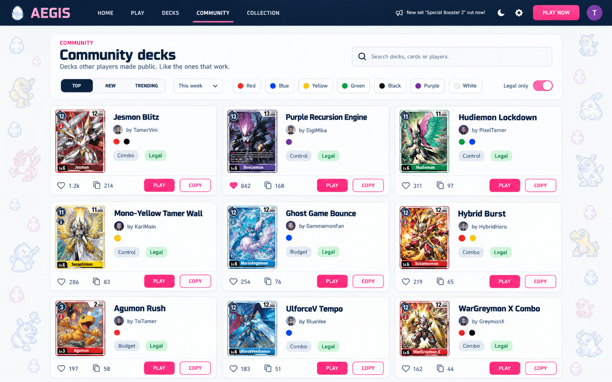
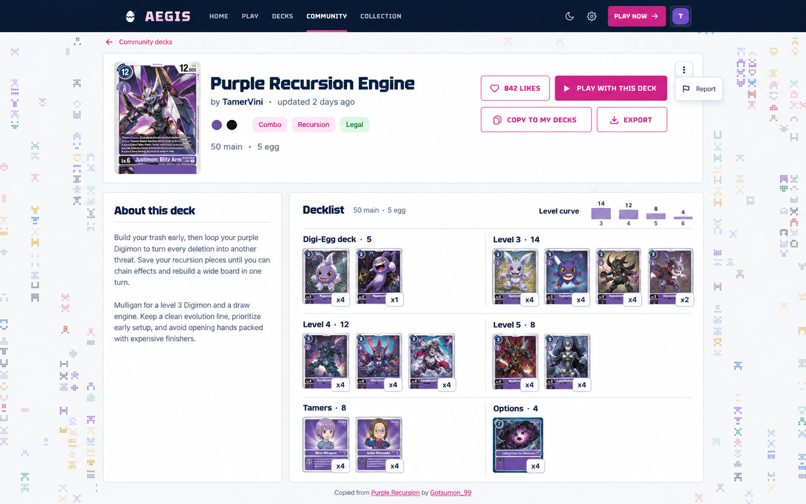
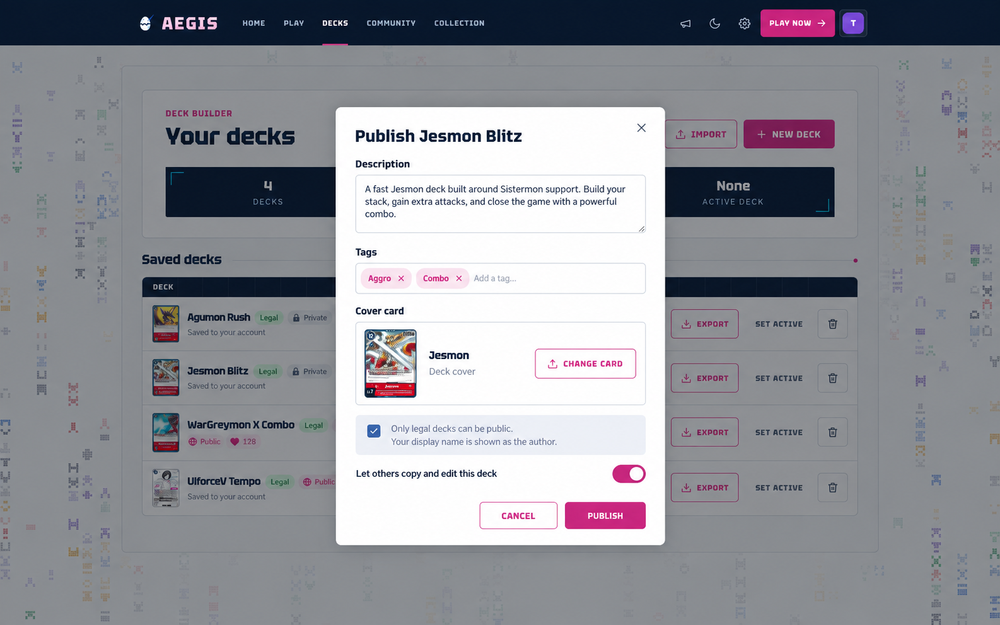
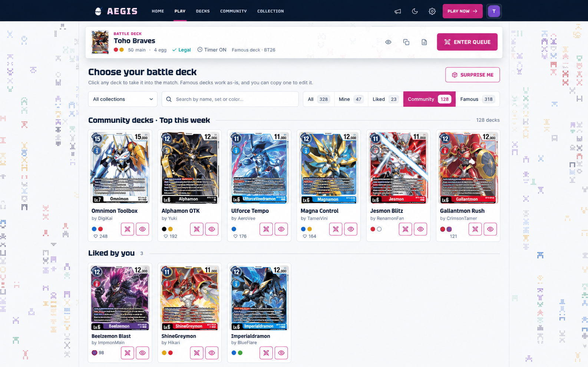

# Community decks: design plan

Date: 2026-10-06 · Branch: `feat/community-decks` · Status: phase 1 built

## Goal

Players can make a saved deck public. Other players can browse public decks,
like them, play with them, and copy them into their own decks to edit. The
most-liked decks rank first.

This answers two Discord requests:

- "Community decks": publish a deck so others can play with it or copy and
  edit it. The famous presets are too basic for many archetypes.
- "Upvotes": let the good lists rise to the top.

## What was built

Phase 1, plus the lobby filter. These changes differ from the proposal below:

| Proposal | Built |
| --- | --- |
| Description and tags on a public deck | Dropped. The deck name is the only free text. |
| Report button | Not built. A name filter blocks offensive names instead. |
| Keyset pagination | Offset pages of 24, capped at page 200. Enough at this size. |
| "Legal only" filter | A "Not legal" label instead. Publishing an illegal deck is refused. |
| Trending sort | Not built. Top (week, month, all time) and New are built. |
| Lobby Community and Liked filters | Community is built. Liked is not. |
| `copied_from` attribution | Not built. A copy's subtitle names the author. |

### Name filter

`apps/api/src/community/deckNameModeration.ts` uses
[`obscenity`](https://github.com/jo3-l/obscenity) (MIT):

- The English dataset handles leetspeak (`Sh1t`).
- Portuguese and Spanish terms are added on top of it.
- Accented letters are stripped before matching.
- A test runs every card name and famous archetype through the filter. Any card-name
  word the filter flags (for example Vulcanusmon) is allowed back automatically, so a
  new set cannot block its own Digimon.
- Known gap: spaced-out letters (`f u c k`) pass.

### Where the code is

| Layer | Files |
| --- | --- |
| Shared | `packages/shared/src/decks/community.ts` (wire types), `legality.ts` (legality, moved from the web) |
| API | `apps/api/src/community/` (store, routes, name filter, tests), migration `019-community-decks.ts` |
| Web | `apps/web/src/community/` (client, hooks), `screens/community/` (browse, deck page, like, lobby section), `screens/DeckPublishModal.tsx` |

## What already exists

| Piece | Where | Reuse |
| --- | --- | --- |
| Saved decks per account | `saved_decks`, PK `(account_id, id)`; `AccountStore.saveDeck/decks/deleteDeck` | Source of a published deck |
| Deck CRUD routes | `apps/api/src/accounts/routes.ts:173-230` | Same auth pattern (`requireSession`) |
| Migrations | `apps/api/src/db/migrations/` 001–018, custom runner | Add `019-community-decks.ts` |
| Copy a preset into my decks | `copyDeckPreset()` in `apps/web/src/game/decks.ts:119` | Same flow for a public deck |
| Play with any deck | The room takes `options.deck` from the client (`AegisRoom.ts:371`) | No game-server change |
| Preset browser in lobby | `DeckPicker.tsx`, `FamousDeckListDialog.tsx` | Add a "Community" filter |
| Admin flag | `accounts.is_admin` | Moderation (hide a deck) |

Today nothing in the codebase has public decks, likes or votes.

## Screens

Prototypes (Codex `imagegen`, based on screenshots of the running app):

### 1. Community browse, `/community`



- Sort: **Top** (default), **New**, **Trending**. Top has a period: week, month, all time.
- Filters: colors, "Legal only" (on by default), text search over the deck name,
  the author and the card names or ids.
- Each tile: cover, name, author, colors, tags, legality, likes, copies,
  **Play** and **Copy**.

### 2. Public deck page, `/community/decks/:id`



- Like, **Play with this deck**, **Copy to my decks**, **Export** (existing text/PNG export).
- The author's description, shown as plain text only.
- The decklist grouped by level, the same as the editor.
- "Copied from X by Y": the deck it was copied from, as a link.
- Report action in the overflow menu.

### 3. Publish from "Your decks"



- Each row gets a **Private** or **Public** pill. Public rows also show the like count.
- The publish dialog has a description, tags and the cover card. (Built without them: name only.)
- **Change from the prototype:** drop the "Let others copy and edit" switch.
  A public list can always be retyped, so the switch protects nothing and
  only adds a state to support.

### 4. Lobby deck picker



- The filter row becomes **All · Mine · Liked · Community · Famous**.
- **Community** shows the top decks this week.
- **Liked** shows the decks this player liked. This is how a player keeps a
  deck "in their collection" without copying it.

## Key decisions

### Publish a snapshot, not a flag on `saved_decks`

Publishing copies the deck into a new `public_decks` row. Editing the private
deck does not change the public one. The owner clicks **Update public
version** to push changes.

Why:

- Likes stay attached to the list people actually liked.
- `saved_decks` ids are made by the client and are only unique per account
  (`custom-1`). A public deck needs a global id for URLs. A new table gives
  it a `uuid` without touching the sync logic in `App.tsx:180-226`.
- The 100-deck limit and the local-first merge stay as they are.

Cost: two copies of a published list. They are small (55 card ids).

### Likes only, no downvotes

- Only signed-in accounts can like. Guests can browse, play and copy.
- One like per account per deck. Authors cannot like their own deck.
- No downvotes. Downvotes invite brigading, and the ranking only needs to
  push good decks up.

### Ranking

| Sort | Rule |
| --- | --- |
| Top (period) | Count of likes with `created_at` inside the period, then `published_at` |
| Top (all time) | Stored `like_count` |
| New | `published_at DESC` |
| Trending | `likes_7d / (age_hours + 2)^1.5` (Hacker News style), computed in SQL |

"Top this week" is the default. An all-time ranking freezes early decks at
the top, so new archetypes would never surface.

### Legality is checked when read, not when stored

The ban list changes. A deck that was legal when published can become illegal.
The API checks each list against the current card pool and ban list (the same
check `isFamousDeckAvailable` uses) and returns `legal: boolean`. "Legal only"
hides the illegal ones. Publishing an illegal deck is refused.

## Data model (migration `019-community-decks.ts`)

```sql
CREATE TABLE public_decks (
  id uuid PRIMARY KEY,
  account_id uuid NOT NULL REFERENCES accounts(id),
  source_deck_id text NOT NULL,
  name varchar(60) NOT NULL,
  description varchar(2000) NOT NULL DEFAULT '',
  tags text[] NOT NULL DEFAULT '{}',
  colors text[] NOT NULL,
  main_deck jsonb NOT NULL,
  egg_deck jsonb NOT NULL,
  main_deck_arts jsonb,
  egg_deck_arts jsonb,
  cover_card_id text,
  copied_from_id uuid REFERENCES public_decks(id) ON DELETE SET NULL,
  like_count integer NOT NULL DEFAULT 0,
  copy_count integer NOT NULL DEFAULT 0,
  status text NOT NULL DEFAULT 'public', -- public | unpublished | hidden
  published_at bigint NOT NULL,
  updated_at bigint NOT NULL,
  UNIQUE (account_id, source_deck_id)
);
CREATE INDEX public_decks_top ON public_decks (like_count DESC, published_at DESC) WHERE status = 'public';
CREATE INDEX public_decks_new ON public_decks (published_at DESC) WHERE status = 'public';
CREATE INDEX public_decks_colors ON public_decks USING gin (colors);
CREATE INDEX public_decks_cards ON public_decks USING gin (main_deck jsonb_path_ops);

CREATE TABLE public_deck_likes (
  public_deck_id uuid NOT NULL REFERENCES public_decks(id) ON DELETE CASCADE,
  account_id uuid NOT NULL REFERENCES accounts(id),
  created_at bigint NOT NULL,
  PRIMARY KEY (public_deck_id, account_id)
);
CREATE INDEX public_deck_likes_recent ON public_deck_likes (created_at, public_deck_id);
CREATE INDEX public_deck_likes_account ON public_deck_likes (account_id, created_at DESC);

CREATE TABLE public_deck_reports (
  public_deck_id uuid NOT NULL REFERENCES public_decks(id) ON DELETE CASCADE,
  account_id uuid NOT NULL REFERENCES accounts(id),
  reason text NOT NULL,
  created_at bigint NOT NULL,
  PRIMARY KEY (public_deck_id, account_id)
);

ALTER TABLE saved_decks ADD COLUMN copied_from_public_id uuid;
```

Notes:

- Timestamps are `bigint` milliseconds, like the existing tables.
- `like_count` changes in the same transaction as the insert or delete in
  `public_deck_likes`. The `PRIMARY KEY` makes like and unlike idempotent.
- Unpublish sets `status = 'unpublished'` and keeps the likes, so publishing
  again restores them. Admins set `status = 'hidden'`.
- `main_deck @> '["BT1-009"]'` uses the GIN index for "decks with this card".

## API

Every write requires a session and follows the existing `requireSession` pattern.

| Method | Path | Auth | Purpose |
| --- | --- | --- | --- |
| `PUT` | `/account/decks/:id/publication` | owner | Publish, or update the public version. Body: `{ description, tags, coverCardId }`. Returns 422 if the deck is illegal. |
| `DELETE` | `/account/decks/:id/publication` | owner | Unpublish |
| `GET` | `/account/decks/publications` | session | My publications with like counts (for the pills) |
| `GET` | `/community/decks` | optional | List. Query: `sort`, `period`, `colors`, `q`, `card`, `legal`, `cursor`. Adds `likedByMe` when signed in. |
| `GET` | `/community/decks/:id` | optional | One deck with the full list |
| `PUT` | `/community/decks/:id/like` | session | Like (idempotent). Returns 403 on your own deck. |
| `DELETE` | `/community/decks/:id/like` | session | Unlike |
| `GET` | `/account/liked-decks` | session | For the "Liked" lobby filter |
| `POST` | `/community/decks/:id/copies` | session | Copy into `saved_decks` on the server and bump `copy_count`. Guests copy on the client only and do not count. |
| `POST` | `/community/decks/:id/reports` | session | Report |
| `PUT` | `/admin/community/decks/:id/status` | admin | Hide or restore |

- Pagination uses a keyset cursor (`like_count, published_at, id`), not offsets.
- The list endpoint returns tiles without `main_deck`, to keep the payload small.
- Add per-account rate limits to like, publish and report. The API has none
  today; a small in-memory or Redis token bucket is enough.

## Web

| Change | Files |
| --- | --- |
| New `community` screen and the `/community` and `/community/decks/:id` routes | `routes.ts`, `App.tsx` (`NAV_SCREENS`), new `screens/community/` |
| Publish dialog, Private/Public pill, "Update public version" | `DeckList.tsx`, `DeckListCard.tsx`, new `PublishDeckDialog.tsx` |
| Community and Liked filters in the lobby | `DeckPicker.tsx` |
| API client | `account/client.ts` → new `community/client.ts` |
| Copy flow | Reuse `copyDeckPreset` with `copiedFromPublicId` |

Render descriptions as plain text only, never as HTML or Markdown.

## Risks

| Risk | Mitigation |
| --- | --- |
| Like farming with alt accounts | Accounts need Discord or email; the weekly window limits damage; admins can hide decks; add a minimum account age for likes if abuse appears |
| Offensive names or descriptions | Length limits, report button, admin hide. A word filter can come later. |
| A deck becomes illegal after a ban list update | Legality is checked when read; "Legal only" is on by default |
| Copy spam (the same list republished) | Store `copied_from_id` and show attribution. Hash-based duplicate checks can come later. |
| The list query gets slow | Partial indexes, keyset pagination, no deck bodies in the list |

## Phases

1. **MVP**
   - Migration 019.
   - Publish and unpublish.
   - `/community` with Top (week) and New.
   - The deck page.
   - Like, Play and Copy.
   - API and component tests.
2. **Discovery**
   - The Liked and Community lobby filters.
   - Trending.
   - Tags, and search by card.
   - Report, and admin hide.
   - Rate limits.
3. **Later**
   - Deck stats from `match_deck_snapshots` (games played, win rate) once a
     deck is played in ranked.
   - Author profile pages.
   - Comments, if they are wanted.

## Open questions

These have sensible defaults. Change them if you disagree.

- **Top-level nav or a tab inside Decks?** Default: a new top-level
  **Community** tab, as in the prototypes. The nav has room.
- **Can guests like?** Default: no. Without an account, likes are trivial to farm.
- **Should famous presets appear in Community?** Default: no. They keep their
  own section, so the ranking reflects players' decks.
